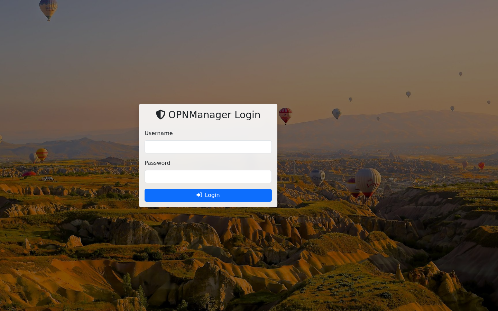
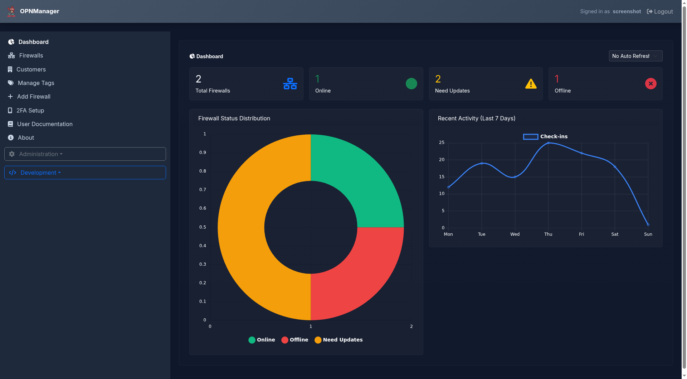
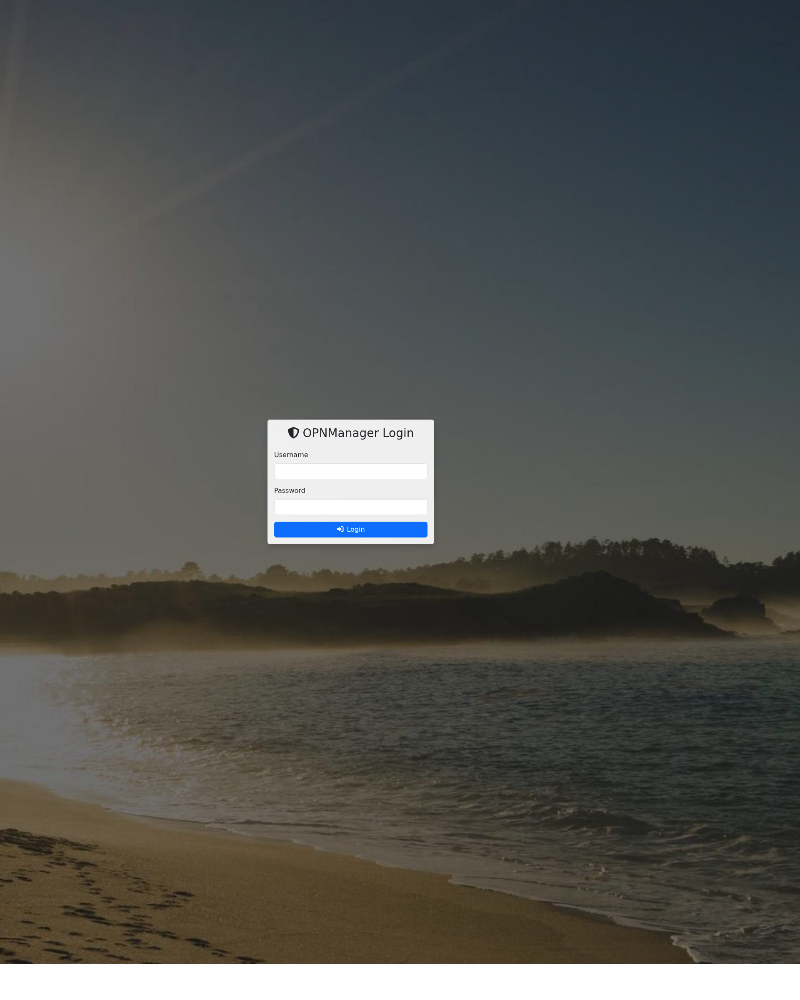
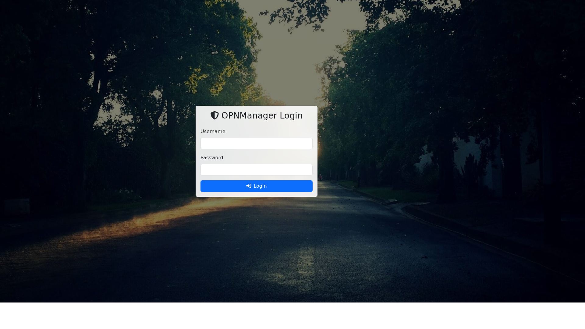

# OPNManager - OPNsense Firewall Management Platform

**Version**: 3.0.1 | **Release**: February 8, 2026 | **Status**: Production Stable ✅

A comprehensive web-based management platform for centralized monitoring, configuration, and maintenance of OPNsense firewalls.

---

## 🌟 Key Features

### Firewall Management
- **Centralized Dashboard**: Monitor all firewalls from a single interface
- **Real-time Status**: Live agent check-ins every 2-5 minutes
- **Dual Agent System**: 
  - Primary Agent (v3.2.0): 2-minute intervals for monitoring & commands
  - Update Agent (v1.1.0): 5-minute intervals for system updates
- **Health Monitoring**: CPU, memory, uptime, network status
- **Tag System**: Organize firewalls with color-coded tags
- **Customer Grouping**: Multi-tenant support with customer organization

### Network Configuration
- **Complete Network Data Display**:
  - WAN: IP, Subnet Mask, Gateway, Primary DNS, Secondary DNS
  - LAN: IP, Subnet Mask, Network Range
- **Real vs Estimated Data Indicators**: Know when you have actual config vs IP class estimates
- **IPv6 Support**: Track both IPv4 and IPv6 addresses
- **Network Config Persistence**: Data preserved between agent check-ins

### System Monitoring
- **Accurate Uptime Tracking**: Real system uptime calculation (not estimated)
- **Version Tracking**: OPNsense version, agent versions, available updates
- **Update Detection**: Agent-reported update availability (no hardcoded versions)
- **Reboot Status**: Track pending reboots and system state
- **Tunnel Status**: Monitor on-demand secure connection state

### Command Execution
- **Remote Command Queue**: Execute commands on firewalls remotely
- **Base64 Encoding**: Support for complex multi-line commands
- **Command History**: Track all executed commands with timestamps
- **Output Capture**: View command results in real-time
- **Timezone Support**: Display command times in multiple timezones

### Configuration Backup
- **Automated Backups**: Scheduled configuration backups
- **Manual Backups**: On-demand backup creation
- **Backup Management**: Download, restore, and delete backups
- **Retention Policies**: Automatic cleanup of old backups
- **Backup Metadata**: Track backup date, type, size, and description

### Secure Connectivity
- **On-Demand Reverse Tunnels**: No exposed ports required
- **SSH Tunneling**: Secure encrypted connections
- **Web Proxy**: Access firewall web UI through manager
- **Connection Status**: Real-time tunnel monitoring

---

## 📸 Screenshots

### Login Page


### Dashboard


### Firewall List


### Settings


### Security Scanner


### System Update


### Support


### About


---

## 📋 System Requirements

### Server Requirements
- **OS**: Ubuntu 22.04 LTS or newer
- **PHP**: 8.0 or higher
- **MySQL/MariaDB**: 8.0+ / 10.6+
- **Web Server**: Apache 2.4+ or Nginx 1.18+
- **Disk Space**: Minimum 10GB (20GB+ recommended for backups)
- **Memory**: Minimum 2GB RAM (4GB+ recommended)

### Client Requirements (Firewalls)
- **OPNsense**: 20.7+ (tested up to 25.7.5)
- **FreeBSD**: 12.x or 13.x
- **Connectivity**: Outbound HTTPS (443) access to manager server
- **Shell**: /bin/sh or /bin/bash
- **Tools**: curl, ifconfig, netstat

---

## 🚀 Quick Start

### 1. Server Installation

```bash
# Clone or download the application
cd /var/www
git clone https://github.com/yourusername/opnmanager.git opnsense

# Set proper permissions
chown -R www-data:www-data /var/www/opnsense
chmod 755 /var/www/opnsense

# Import database schema
mysql -u root -p < /var/www/opnsense/database/schema.sql

# Configure database connection
cp /var/www/opnsense/inc/db.php.example /var/www/opnsense/inc/db.php
nano /var/www/opnsense/inc/db.php
# Update: DB_HOST, DB_NAME, DB_USER, DB_PASS

# Configure Apache virtual host
cp /var/www/opnsense/config/apache.conf.example /etc/apache2/sites-available/opnmanager.conf
a2ensite opnmanager
systemctl reload apache2
```

### 2. Firewall Enrollment

#### Option A: Automated Enrollment (Recommended)

```bash
# On the OPNsense firewall:
fetch -o - https://your-manager-server.com/enroll_firewall.php | sh
```

#### Option B: Manual Enrollment

1. Log into OPNManager web interface
2. Navigate to Firewalls → Add Firewall
3. Fill in firewall details (name, IP, customer, etc.)
4. Copy the agent installation script
5. SSH to firewall and execute the script

### 3. Agent Installation

The enrollment script automatically installs both agents:

- **Primary Agent**: `/usr/local/etc/opnmanager/agent_primary.sh`
- **Update Agent**: `/usr/local/etc/opnmanager/agent_update.sh`

Agents are configured in `/usr/local/etc/rc.local` for auto-start on boot.

---

## 📦 Database Schema

### Version: 1.3.0 (October 12, 2025)

#### Main Tables

**firewalls** - Primary firewall records
- Core: id, firewall_key, hostname, ip_address, customer_id
- Network: wan_ip, lan_ip, ipv6_address
- Network Config (NEW v1.3.0): wan_netmask, wan_gateway, wan_dns_primary, wan_dns_secondary, lan_netmask, lan_network
- Status: status, last_checkin, agent_version, uptime, reboot_required
- Versions: version, current_version, available_version, updates_available
- Config: checkin_interval, ssh_port, notes

**firewall_agents** - Dual agent tracking (v2.0.0+)
- PRIMARY KEY: (firewall_id, agent_type)
- agent_type: 'primary' or 'update'
- agent_version, status, last_checkin
- Network: wan_ip, lan_ip, ipv6_address
- Version: opnsense_version (JSON)

**tags** - Firewall categorization
- id, name, color

**firewall_tags** - Junction table (many-to-many)
- firewall_id, tag_id

**customers** - Multi-tenant organization
- id, name, contact_info, notes

**backups** - Configuration backups
- id, firewall_id, backup_file, backup_date, type, description, size

**command_queue** - Remote command execution
- id, firewall_id, command, description, status, output
- created_at, executed_at, command_index

---

## 🔧 Configuration

### Agent Configuration

**Primary Agent** (`/usr/local/etc/opnmanager/agent_primary.sh`):
```bash
# Key settings
MANAGER_URL="https://your-manager.com/agent_checkin.php"
FIREWALL_KEY="your-firewall-key"
CHECK_INTERVAL=120  # 2 minutes
AGENT_TYPE="primary"
```

**Update Agent** (`/usr/local/etc/opnmanager/agent_update.sh`):
```bash
# Key settings
MANAGER_URL="https://your-manager.com/agent_checkin.php"
FIREWALL_KEY="your-firewall-key"
CHECK_INTERVAL=300  # 5 minutes
AGENT_TYPE="update"
```

### Network Data Collection

Agents automatically collect network configuration:

**WAN Interface** (default: igb0):
```bash
# Subnet mask
ifconfig igb0 | grep 'inet ' | awk '{print $4}'

# Gateway
netstat -rn | grep default | awk '{print $2}'

# DNS servers
grep nameserver /etc/resolv.conf | head -2
```

**LAN Interface** (default: igb1):
```bash
# Subnet mask
ifconfig igb1 | grep 'inet ' | awk '{print $4}'

# Network range
ifconfig igb1 | grep 'inet ' | awk '{print $2 "/" $4}'
```

### Check-in Intervals

Configure per-firewall in Firewall Details → Configuration:
- **Minimum**: 30 seconds (not recommended)
- **Default**: 120 seconds (2 minutes) for primary
- **Default**: 300 seconds (5 minutes) for update agent
- **Maximum**: 3600 seconds (1 hour)

---

## 🎨 UI Features

### Dashboard
- Firewall status grid with color-coded health
- Quick search and filtering
- Tag-based organization
- Customer grouping
- Bulk actions (update all, backup all)

### Firewall Details Page
- Real-time status display
- Complete network configuration
- Agent version tracking (primary + update)
- On-demand secure connection
- Configuration settings
- Command execution log
- Backup management

### Network Information Display
- **WAN Section**: 
  - IP Address with ISP detection
  - Subnet Mask
  - Gateway
  - Primary DNS
  - Secondary DNS (if available)
  - Data source indicator (Current Data vs Estimated)
  
- **LAN Section**:
  - IP Address
  - Subnet Mask
  - Network Range (CIDR)
  - Data source indicator

### Color Coding
- 🟢 **Green**: Online and healthy
- 🟡 **Yellow**: Warning (updates available, high resource usage)
- 🔴 **Red**: Critical (offline, reboot required)
- ⚫ **Gray**: Unknown or no recent check-in

---

## 🔐 Security

### Authentication
- Secure password hashing (PHP password_hash)
- Session management with CSRF protection
- Login attempt logging
- Session timeout configuration

### Agent Communication
- HTTPS-only agent check-ins
- Firewall-specific API keys
- Base64-encoded command payloads
- PID file locking prevents duplicate agents

### Secure Connections
- On-demand SSH reverse tunnels
- No exposed firewall ports required
- Encrypted traffic through manager
- Automatic tunnel cleanup

---

## 📊 Monitoring & Alerts

### System Health Checks
- Agent connectivity (online/offline detection)
- Agent version compliance
- Database connectivity
- Backup status
- Update availability

### Health Indicators
- Uptime tracking
- Reboot required status
- Update availability badges
- Resource utilization
- Network configuration status

---

## 🐛 Troubleshooting

### Agent Not Checking In

```bash
# On firewall, check agent process
ps aux | grep agent

# Check agent logs
tail -f /var/log/opnmanager_agent.log

# Test manual check-in
/usr/local/etc/opnmanager/agent_primary.sh

# Verify network connectivity
curl -v https://your-manager.com/agent_checkin.php
```

### Uptime Shows Incorrect Value

**Fixed in v2.1.0** - Ensure you have:
- `agent_checkin.php` with DateTime-based uptime calculation
- Firewall agent v3.2.0+ reporting real uptime
- Database column `uptime` populated

### Network Data Shows "Estimated"

Agents must report network configuration. Check:
1. Agent script collects ifconfig data
2. Agent POSTs wan_netmask, wan_gateway, lan_netmask, lan_network
3. Database columns exist (added in v1.3.0 schema)

### Updates Show Incorrectly

**Fixed in v2.1.0** - Agent now determines update availability:
- Agent checks OPNsense update system
- Reports `updates_available` (0 or 1) in POST
- No hardcoded version comparison on server

### Tag Edit Modal Unreadable

**Fixed in v2.1.0** - Dark theme applied:
- Clear browser cache
- Verify `manage_tags_ui.php` has modal dark styles
- Check `inc/header.php` form control contrast (v2.1.0+)

---

## 📝 Version History

### v2.1.0 - Data Accuracy & UI Polish (2025-10-12)
- ✅ Fixed uptime calculation (was hardcoded)
- ✅ Fixed network data persistence
- ✅ Removed hardcoded update versions
- ✅ Enhanced UI contrast across application
- ✅ Added complete network configuration display
- ✅ Database schema v1.3.0 (network columns)

### v2.0.0 - Dual Agent System (2025-10-10)
- ✅ Separate Primary and Update agents
- ✅ Base64 command encoding
- ✅ Enhanced command execution
- ✅ Improved agent tracking

### v1.0.0 - Production Ready (2025-10-09)
- ✅ Tag management fixes
- ✅ Centralized version management
- ✅ Comprehensive documentation
- ✅ Production stability

See [CHANGELOG_v2.1.0.md](CHANGELOG_v2.1.0.md) for complete version history.

---

## 🤝 Contributing

### Reporting Issues
- Use GitHub Issues for bug reports
- Include OPNManager version
- Include agent version
- Provide error logs when applicable

### Development Setup
```bash
# Enable debug mode
echo "define('DEBUG_MODE', true);" >> /var/www/opnsense/inc/config.php

# Check logs
tail -f /var/log/apache2/error.log
tail -f /var/log/opnmanager/debug.log
```

---

## 📄 License

[Your License Here]

---

## 🙏 Acknowledgments

- OPNsense project for the excellent firewall platform
- Bootstrap for the UI framework
- Font Awesome for icons
- The open-source community

---

## 📞 Support

- **Documentation**: [CHANGELOG_v2.1.0.md](CHANGELOG_v2.1.0.md)
- **Quick Reference**: [QUICK_REFERENCE.md](QUICK_REFERENCE.md)
- **Knowledge Base**: [KNOWLEDGE_BASE.md](KNOWLEDGE_BASE.md)
- **Issues**: GitHub Issues
- **Email**: support@yourdomain.com

---

**Built with ❤️ for OPNsense firewall administrators**

**Current Version**: 3.0.1 | **Database**: 1.3.0 | **Agent**: 3.2.0 | **Last Updated**: February 8, 2026
