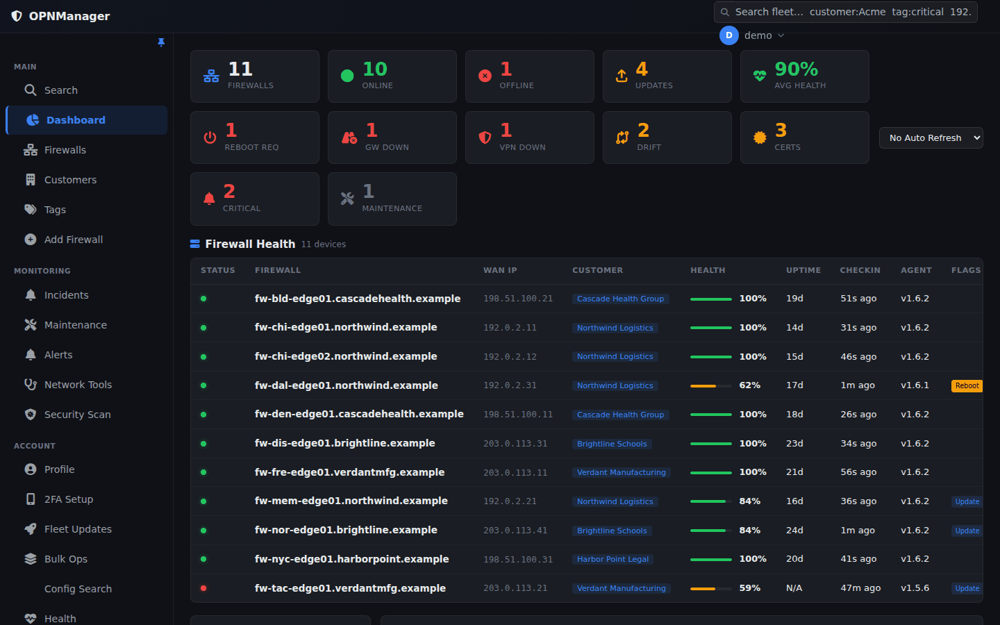
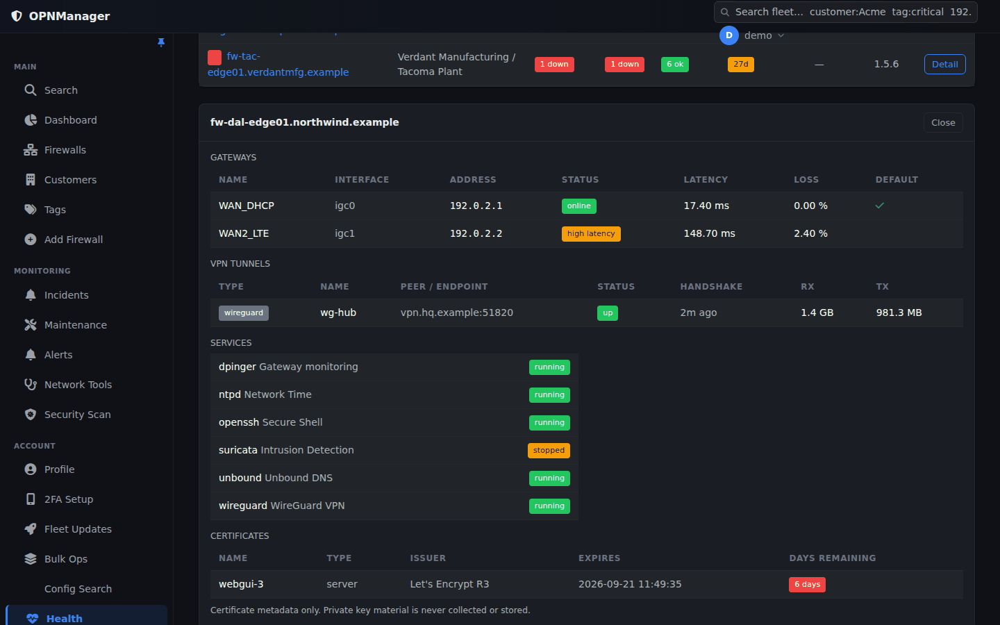
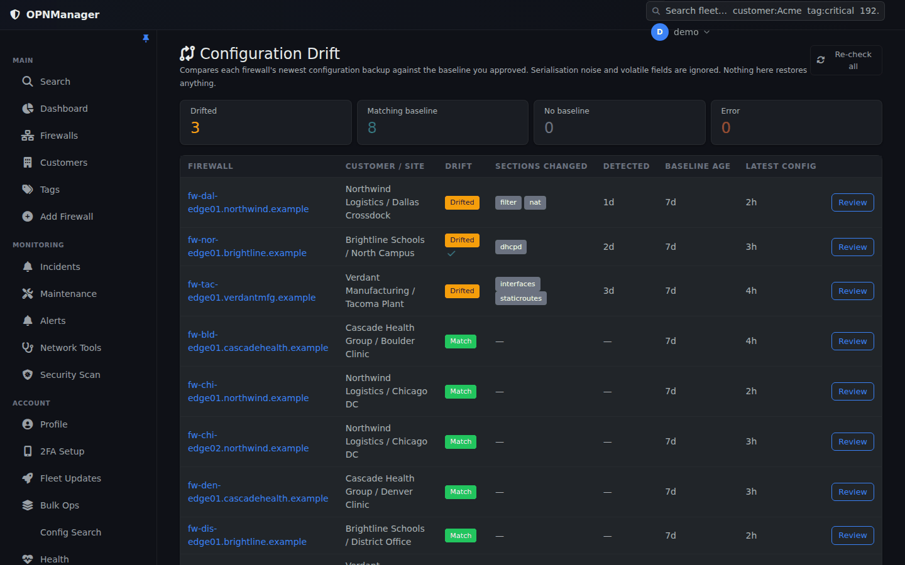
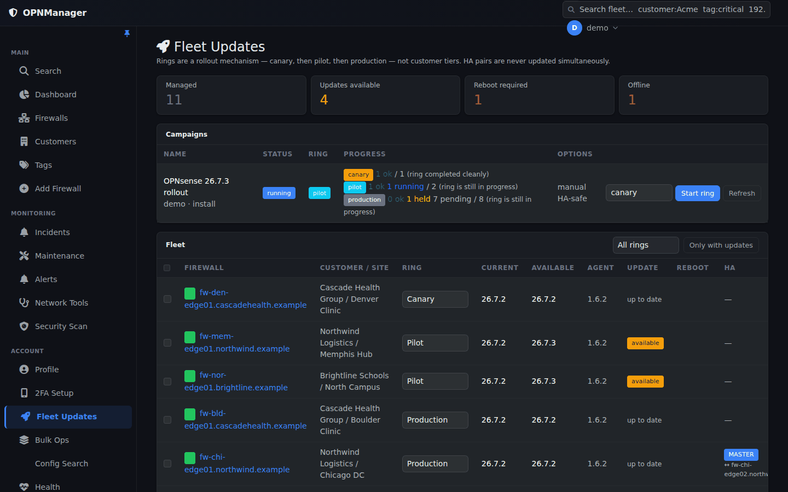
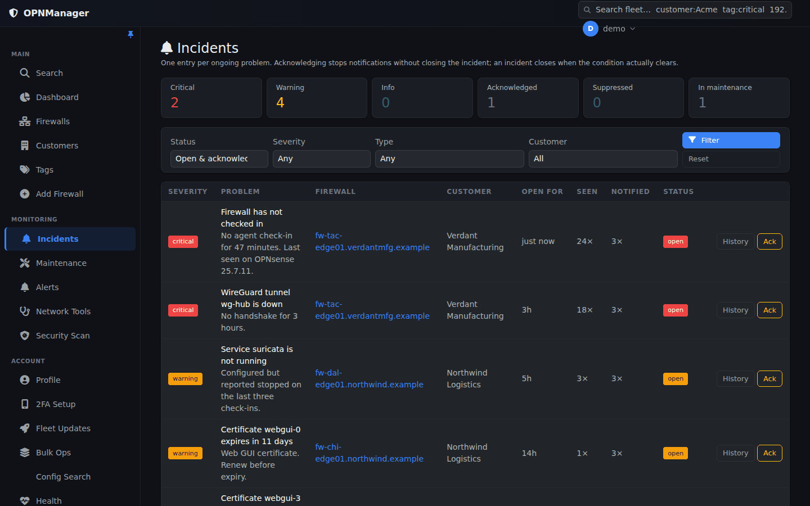
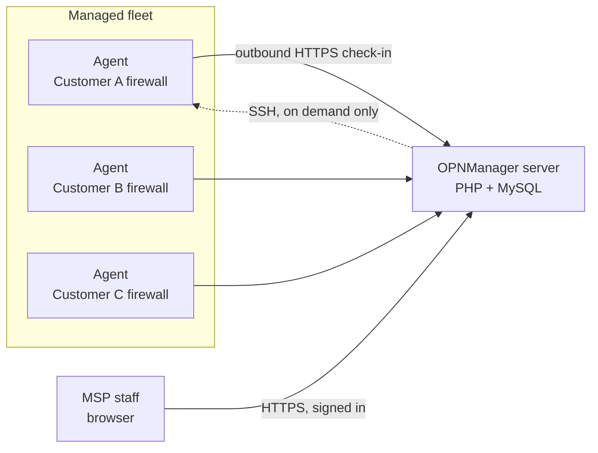

<div align="center">

# OPNManager

**Self-hosted OPNsense fleet management for MSPs and IT teams.**

[](https://github.com/agit8or1/OPNMGR/actions/workflows/ci.yml)
[](LICENSE)
[](CHANGELOG.md)

</div>

OPNManager runs on your own server and gives your staff one place to watch, back up
and update every OPNsense firewall you look after, grouped by customer and site.
Customers and sites are organisational groupings inside your installation — they are
not tenant logins, and nobody outside your own team signs in.

[Quick Start](#quick-start) · [Screenshots](#screenshot-tour) · [Documentation](#documentation) · [Releases](https://github.com/agit8or1/OPNMGR/releases) · [Security](SECURITY.md)

---

[](docs/images/github/fleet-dashboard.png)

<sub>All screenshots show the real interface populated with simulated data from an
isolated demo fixture. Addresses are reserved documentation ranges and every
organisation and hostname is fictitious.</sub>

---

## What it helps you do

### Find firewall and connectivity problems

Agents report check-ins, gateway latency and loss, VPN tunnel state, CARP status,
service state and certificate expiry. Problems become incidents — one entry per
ongoing condition, opened when it starts and closed when it actually clears, rather
than one email per poll.

### Review configuration backups and changes

Configurations are backed up on a schedule and kept per firewall. Mark one as the
approved baseline and every firewall is compared against it, ignoring serialisation
noise and the fields OPNsense rewrites on every save, so an untouched firewall does
not report drift. Nothing is ever restored automatically.

### Coordinate maintenance and updates

Updates run as campaigns through canary, pilot and production rings, with manual
progression between them. Members of a CARP pair are never updated at the same time.
Maintenance windows scoped to a firewall, a site or a customer withhold notifications
while collection and health display continue.

---

## Screenshot tour

| | |
|---|---|
| [](docs/images/github/firewall-health.png) | [](docs/images/github/config-drift.png) |
| **Firewall health** — gateways, tunnels, services and certificates for one firewall, as reported by its agent. | **Configuration drift** — what changed since the baseline you approved, named by section. |
| [](docs/images/github/fleet-updates.png) | [](docs/images/github/incidents.png) |
| **Fleet updates** — rollout rings, campaign progress and HA pairing. | **Incidents** — one entry per ongoing problem, with acknowledgement and an event trail. |

---

## How it fits together


```mermaid
flowchart LR
    subgraph fleet["Managed fleet"]
        direction TB
        a1["Agent<br/>Customer A firewall"]
        a2["Agent<br/>Customer B firewall"]
        a3["Agent<br/>Customer C firewall"]
    end

    server["OPNManager server<br/>PHP + MySQL"]
    staff["MSP staff<br/>browser"]

    a1 -->|outbound HTTPS check-in| server
    a2 --> server
    a3 --> server
    server -.->|SSH, on demand only| a1
    staff -->|HTTPS, signed in| server
```

Firewalls are never polled. Each agent makes an outbound HTTPS check-in to the
manager, reports what it has collected, and picks up any work queued for it — so no
inbound port has to be opened on a customer's firewall for normal operation. The one
exception is on-demand SSH access for the web proxy and tunnels: the agent first
installs a time-limited rule permitting only the manager's address, and the manager
then connects out to the firewall for the length of that session.

---

## Quick Start

Requires Ubuntu 22.04 LTS or newer, PHP 8.0+ (CI builds against 8.3), MySQL 8.0+ or
MariaDB 10.6+, and Apache 2.4+ or Nginx 1.18+.

### 1. Server

```bash
cd /var/www
git clone https://github.com/agit8or1/OPNMGR.git opnsense
cd /var/www/opnsense

composer install --no-dev

# Creates the opnsense_fw database, every table and the reference data.
# Safe to re-import: every statement is idempotent.
mysql -u root -p < database/schema.sql

mysql -u root -p -e "
  CREATE USER 'opnsense_user'@'localhost' IDENTIFIED BY 'your-secure-password';
  GRANT ALL PRIVILEGES ON opnsense_fw.* TO 'opnsense_user'@'localhost';
  FLUSH PRIVILEGES;"

cp .env.example .env
# Set at minimum DB_HOST, DB_NAME, DB_USER, DB_PASS and APP_URL.
chmod 640 .env

# Required since 3.12: encrypts agent credentials and SSH keys at rest.
php scripts/generate_master_key.php

php scripts/create_admin.php

chown -R www-data:www-data /var/www/opnsense
a2ensite opnmanager && systemctl reload apache2
```

### 2. Agent

Sign in, open **Settings**, and copy the install one-liner shown there. It is built
from your own server's hostname:

```sh
# On the OPNsense firewall, as root:
fetch -o - https://<your-opnmgr-server>/downloads/plugins/install_opnmanager_agent.sh | sh
```

Then configure the agent under **Services → OPNManager Agent** in the OPNsense GUI.
The agent installs as a native plugin, checks in every two minutes by default, logs to
`/var/log/opnmanager_agent.log`, and is managed with
`service opnmanager_agent start|stop|restart`.

> The installer script currently fetches the agent package from the project's own
> distribution host rather than from your server. If your firewalls cannot reach it,
> mirror `downloads/plugins/os-opnmanager-agent-<version>.tar.gz` yourself and adjust
> `PLUGIN_URL` in the installer.

---

## Compatibility and feature availability

| | Version | Notes |
|---|---|---|
| Application | 3.22.0 | Install from `main`. See the caveat under Releases below. |
| Agent | v1.6.2 | Newest published package in `downloads/plugins/`. |
| Minimum supported agent | 1.3.0 | Older agents are refused. |
| Database schema | 1.4.0 | `database/schema.sql`, regenerated by `scripts/generate_schema.sh`. |

CI enforces these against `VERSION` and the published artifact — application 3.22.0,
**Agent**: v1.6.2 — so no reference in the tree can drift out of step.

Feature availability depends on the agent version a firewall is actually running:

| Feature | Requires | Status |
|---|---|---|
| Check-ins, system stats, traffic, latency | agent 1.3.0+ | Released |
| Configuration backup, restore, drift | agent 1.3.0+ | Released |
| Fleet updates, rings, HA-safe ordering | agent 1.3.0+ | Released |
| Incidents and maintenance windows | server only | Released |
| Health telemetry — gateways, VPN, CARP, services, certificates | agent 1.6.2+ | Released. 1.6.0 reported no gateways and 1.6.1 miscounted services; use 1.6.2. |
| AI configuration review | server only, opt-in | Released, off by default. Secrets are redacted before anything leaves your server and redaction cannot be disabled. |

Firewalls below the health minimum are shown as *not reporting* rather than as
failures. Anything present in this repository but not listed above should be treated
as source-only until it appears in [CHANGELOG.md](CHANGELOG.md).

**Validated on** OPNsense 26.7 (FreeBSD 14), which is what the maintainer's own fleet
runs. Earlier releases may work — the agent needs only a POSIX shell, `fetch` and
`configctl` — but are not tested. Firewalls need outbound HTTPS to the manager; no
inbound port is required.

### Releases

[v3.22.0](https://github.com/agit8or1/OPNMGR/releases/latest) is the current tagged
release. Tagging has been intermittent — v3.11.1 was the previous tag, with 3.12
through 3.21 shipped on `main` and recorded only in the changelog — so
[CHANGELOG.md](CHANGELOG.md) remains the authoritative history rather than the
releases page. There is no formal support or LTS policy, so treat this as actively
developed software and read the changelog before upgrading.

---

## Documentation

| | |
|---|---|
| [CHANGELOG.md](CHANGELOG.md) | Full release-by-release history. |
| [FEATURES.md](FEATURES.md) | Feature reference. |
| [docs/UPGRADING.md](docs/UPGRADING.md) | Upgrading the server and the agent fleet. |
| [SECURITY.md](SECURITY.md) | Security architecture and how to report a vulnerability. |
| [docs/QUICK_REFERENCE.md](docs/QUICK_REFERENCE.md) | Day-to-day operator commands. |

---

## Security

Agents authenticate with a per-firewall API key and HMAC signing secret. Secrets,
SSH private keys and MFA recovery codes are encrypted at rest with XChaCha20-Poly1305
keyed from `.env`. Agent updates are Ed25519-signed and verified before installation,
with automatic rollback. Remote operations go through a validated action catalogue;
raw shell is a separate, audited, explicitly privileged path. Certificate metadata is
collected, never private key material.

Read [SECURITY.md](SECURITY.md) before exposing an installation, and report
vulnerabilities through the process described there rather than in a public issue.

## Contributing

Issues and pull requests are welcome — there are
[templates](https://github.com/agit8or1/OPNMGR/issues/new/choose) for bugs, features
and questions. CI lints every PHP and shell file, validates Composer dependencies,
runs the security regression suite, and enforces that `VERSION` and every version
reference derived from it agree.

## Support

- [Issues](https://github.com/agit8or1/OPNMGR/issues) for bugs and questions
- [mspreboot.com](https://mspreboot.com) — the maintainer's MSP consultancy

## License

MIT — see [LICENSE](LICENSE).

---

<sub>OPNManager is an independent project. It is not affiliated with, endorsed by, or
sponsored by Deciso B.V. or the OPNsense project. "OPNsense" is a registered trademark
of Deciso B.V.</sub>
