# OPNManager - OPNsense Firewall Management Platform

[](https://github.com/agit8or1/OPNMGR/stargazers)

**Status**: Production Stable | **License**: MIT | **Version**: [](https://github.com/agit8or1/OPNMGR/releases) | **Agent**: v1.6.0

Self-hosted centralized OPNsense management for MSPs and IT teams.

OPNManager runs on your own server and manages the OPNsense firewalls belonging to the
customers you support. Customers are organisational containers used to group firewalls
and sites &mdash; they are not accounts and they do not log in. Your own staff sign in and
work across the whole managed fleet, subject to their role.

If you find OPNManager useful, please consider giving it a star on GitHub — it helps others discover the project!

### New in v3.17 — AI Redaction, Dashboard Roll-ups &amp; Hardening

- **AI redaction** — configuration is stripped of password hashes, private keys, pre-shared
  keys, SNMP communities and tokens before any of it reaches an external provider.
  Redaction cannot be disabled, and an unparseable configuration is refused rather than
  sent raw.
- **AI is opt-in and off by default**, behind an explicit disclosure of what is and is not
  transmitted. Nothing in the product requires it.
- **Dashboard roll-ups** for reboots, gateways, VPN, drift, backups, certificates,
  critical incidents and maintenance. Tiles appear only when non-zero.
- **Version consistency enforced in CI** — `VERSION` is authoritative and derived
  references cannot drift.

### v3.16 — Fleet Updates, Bulk Operations &amp; Config Search

- **Fleet update management** with rollout rings (canary &rarr; pilot &rarr; production).
  Rings are a rollout mechanism, not customer tiers, and progression is manual unless
  explicitly automated. A ring with any failure never counts as clean.
- **HA-safe updates** — members of a CARP pair are never updated simultaneously. The
  BACKUP goes first so the MASTER keeps serving, and the second member waits until the
  first is back with CARP settled.
- **Bulk operations** with typed confirmation phrases that include the target count.
  Raw shell is deliberately not a bulk operation.
- **Fleet configuration search** — deterministic, over stored backups, with named checks
  such as "SSH reachable from WAN". No AI in the path.
- **Safer restores** — validated and checksum-verified, a pre-restore snapshot first,
  hostname typed to confirm, and success only recorded once the agent checks in again.

### v3.15 — Incident Alerting &amp; Maintenance Windows

- **Incident-based alerting** — one entry per ongoing problem rather than one per email.
  Opened when a condition becomes true, updated while it persists, resolved when it
  clears. OPEN / ACKNOWLEDGED / RESOLVED, with notification backoff so an offline
  firewall stops notifying every two minutes. 17 alert types across availability,
  gateways, VPN, HA, services, certificates, resources, drift, backups and agent health.
- **Maintenance windows** — scoped to a firewall, a site or a whole customer. Monitoring,
  health collection and incident recording all continue during a window; only outbound
  notification is withheld, and the suppression is recorded on the incident.

### v3.14 — Configuration Drift &amp; Firewall Health

- **Configuration drift** — mark a configuration backup as the baseline and see, per
  firewall, whether the current configuration still matches it. The comparison is
  semantic: serialisation noise and the `<revision>` block OPNsense stamps on every save
  are ignored, so an untouched firewall does not report drift. Diffs name a changed rule
  by its description; findings can be acknowledged, and a new configuration can be
  promoted to baseline. Nothing is ever restored automatically.
- **Firewall health** — gateways with latency, packet loss and flapping detection; VPN
  tunnels across WireGuard, OpenVPN and IPsec; CARP/HA state; services; and certificate
  expiry with configurable 30/14/7 day warnings. Only what the agent reports is shown.
- **Agent 1.6.0** collects the above. Certificate metadata only — private key material is
  never read.

### v3.13 — MSP Roles, Customers &amp; Fleet Search

- **MSP staff roles** — Administrator, Technician and Read Only, defined once as a
  capability matrix rather than role strings scattered through the code. Navigation and
  actions follow the capability, not the role name.
- **Customer and site model** — `Customer -> Site -> Firewall(s)`, with real foreign keys
  replacing the two parallel free-text columns firewalls were previously grouped by.
  Customers carry a short code, timezone, tags, contact details, an active flag and a
  default maintenance window. They remain organisational containers: no accounts, no login.
- **Global fleet search** — header typeahead and a full results page, with field
  qualifiers and CIDR range matching.
- **Audit log UI** — filter by action, user, firewall, result and date range.

### v3.12 — Agent Authentication &amp; Secret Encryption

Security release. See [SECURITY.md](SECURITY.md) for the full architecture.

- **Per-firewall agent credentials** — a 256-bit API key and HMAC signing secret per
  firewall, provisioned over the authenticated check-in and pinned on first use.
  `hardware_id` alone (an md5 of the hostid or WAN MAC) is no longer a credential.
- **Optional signed agent requests** — HMAC-SHA256 with a replay store, deployed in a
  compatibility mode so an installed fleet upgrades without a flag day.
- **Secrets encrypted at rest** — XChaCha20-Poly1305, keyed from `.env`.
- **Verified agent updates** — Ed25519-signed manifest plus SHA-256 per artifact, atomic
  install and automatic rollback.
- **Structured remote operations** — a validated action catalogue replaces hand-built
  shell. Raw shell remains as an explicitly privileged, audited path.

---

## Key Features

### Firewall Management
- **Centralized Dashboard**: Monitor all firewalls from a single interface
- **Real-time Status**: Live agent check-ins every 2 minutes
- **Plugin Agent**: Native OPNsense plugin with auto-update support
- **Health Monitoring**: CPU, memory, disk, uptime, network status
- **Tag System**: Organize firewalls with color-coded tags
- **Customer & Site Grouping**: Organise managed firewalls by customer organisation and site. Customers do not log in.

### Network & Traffic Monitoring
- **WAN Traffic Charts**: Real-time throughput graphs with auto-scaling (Mb/s / Gb/s)
- **Interface Status**: Per-interface RX/TX byte counters with error tracking
- **Latency Monitoring**: Continuous ping measurement to multiple targets
- **Bandwidth Testing**: On-demand iperf3 speed tests with multi-server fallback
- **Smart Counter Detection**: Automatic fallback to pf counters when driver-level counters are broken (virtio_net)

### System Monitoring
- **Accurate Uptime Tracking**: Real system uptime from agent
- **Version Tracking**: OPNsense version, agent version, available updates
- **One-Click Updates**: Trigger OPNsense updates with animated progress status
- **Reboot Control**: Clickable "Reboot Required" badge triggers remote reboot with confirmation
- **Stuck Update Recovery**: Auto-recovery for updates stuck >15 minutes
- **System Stats**: CPU, memory, disk usage charts (1h, 4h, 12h, 24h, 1w, 30d timeframes)

### Command Execution
- **Remote Command Queue**: Execute commands on firewalls remotely
- **Base64 Encoding**: Support for complex multi-line commands
- **Command History**: Track all executed commands with timestamps
- **Output Capture**: View command results in real-time

### Configuration Backup
- **Automated Backups**: Scheduled configuration backups
- **Manual Backups**: On-demand backup creation
- **Backup Management**: Download, restore, and delete backups
- **Retention Policies**: Automatic cleanup of old backups

### AI-Powered Security Analysis
- **Intelligent Configuration Review**: AI-driven analysis of firewall configurations
- **Security Recommendations**: Automated suggestions for improving security posture
- **Risk Assessment**: Identify potential vulnerabilities and misconfigurations

### Secure Connectivity
- **On-Demand SSH Tunnels**: Dynamic reverse tunnels with no exposed ports
- **Web Proxy**: Access firewall web UI through the manager
- **Automatic Cleanup**: Tunnel sessions timeout and clean up automatically

---

## Screenshots

Captured from a live installation with `scripts/take_screenshots.js`. Hostnames, IP
addresses and email addresses are redacted in the rendered page before capture.

### Login


### Dashboard
KPI strip, per-firewall health cards, status chart and network map.


### Firewalls
Sortable, filterable fleet list with health scores and status indicators.


### Customers
Customer organisations used to group managed firewalls. Customers do not log in.

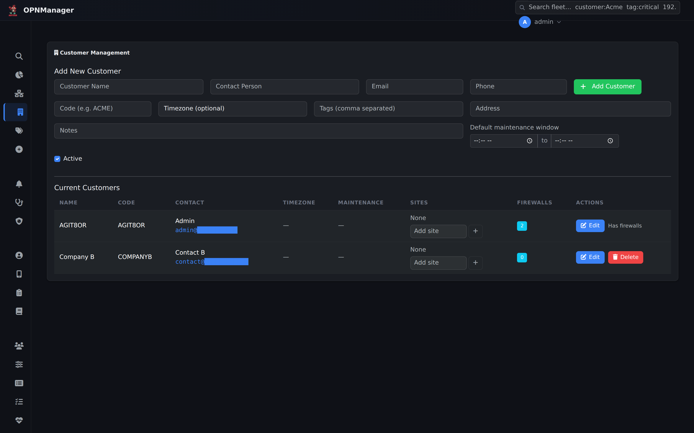

### Alerts
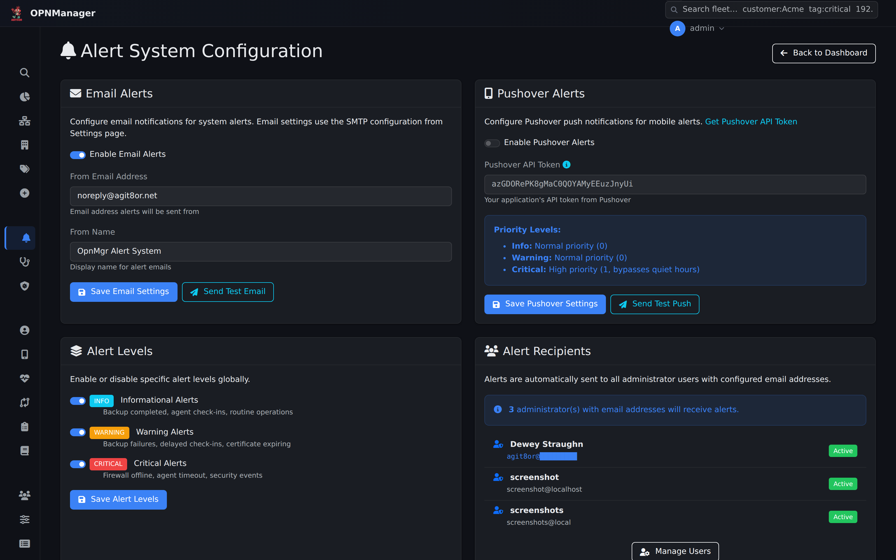

### Fleet Search
One box across the whole fleet. Field qualifiers (`customer:`, `site:`, `tag:`,
`version:`, `agent:`, `ip:`, `interface:`, `vpn:`, `status:`) combine with AND, and a bare
CIDR such as `192.168.22.0/24` matches firewalls with an address inside it.

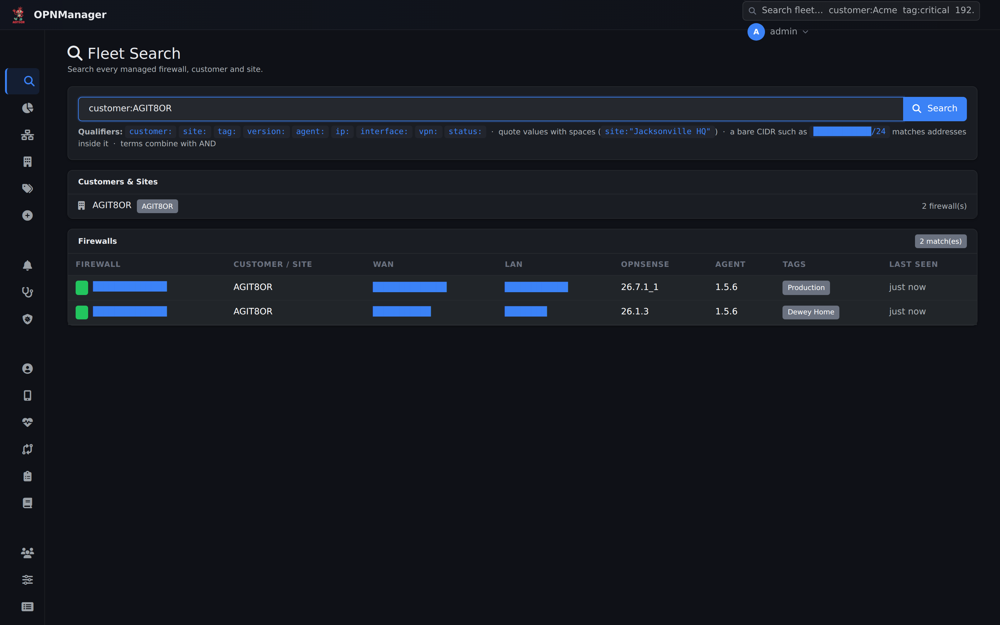

### Firewall Health
Gateways, VPN tunnels, CARP/HA, services and certificate expiry, as reported by the agent.

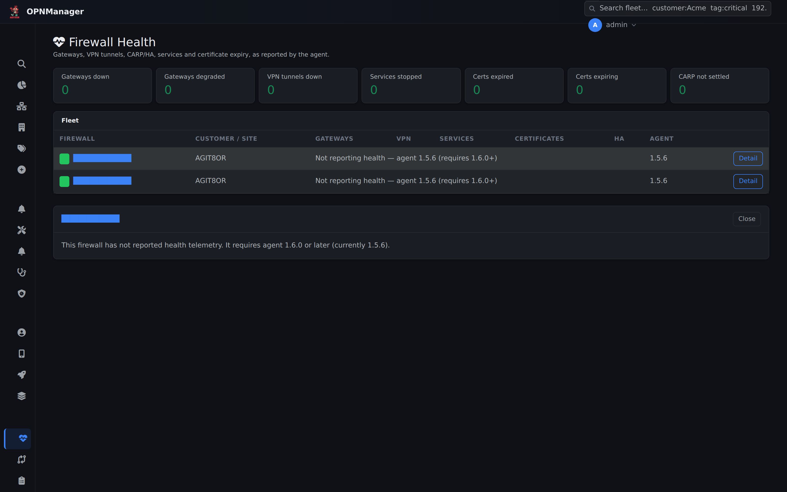

### Configuration Drift
Compares each firewall's current configuration against the approved baseline, ignoring
serialisation noise and volatile fields.

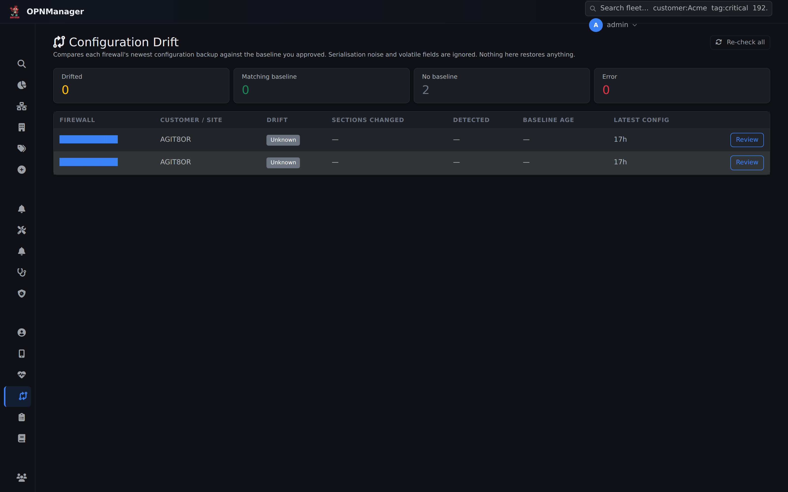

### Fleet Updates
Rollout rings, campaign progress and HA pairing at a glance.

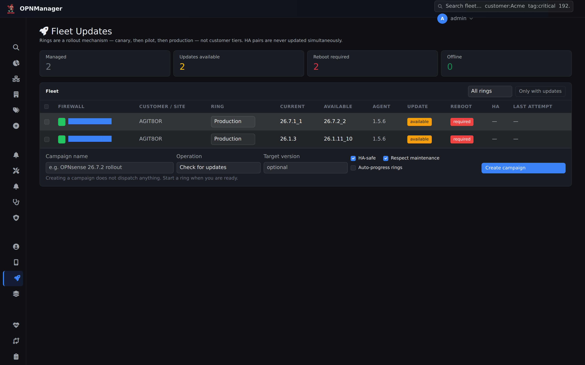

### Configuration Search
Deterministic answers across every stored configuration.

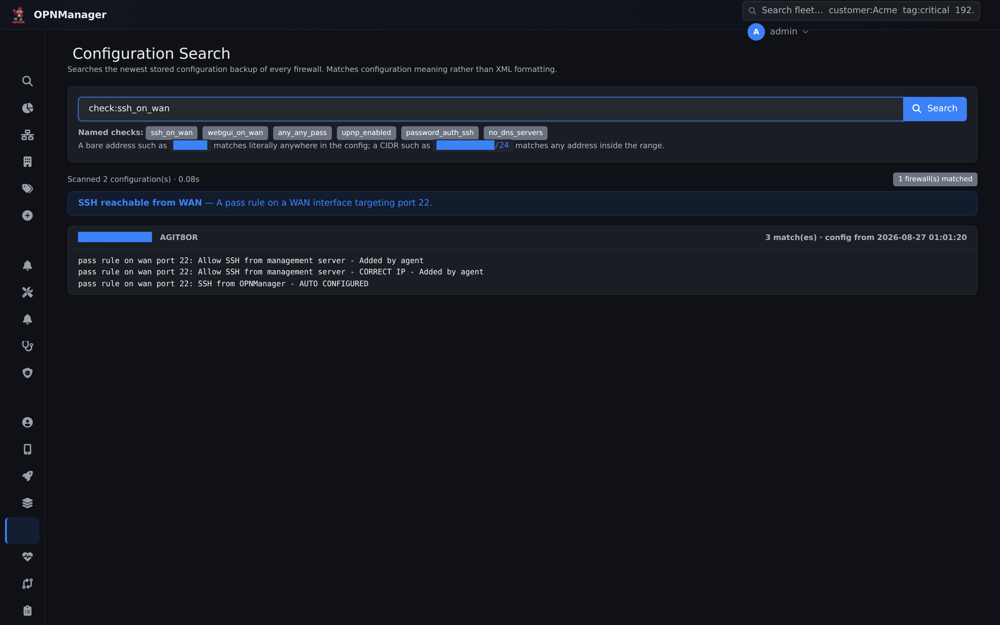

### Incidents
One entry per ongoing problem, with acknowledgement and a full event trail.

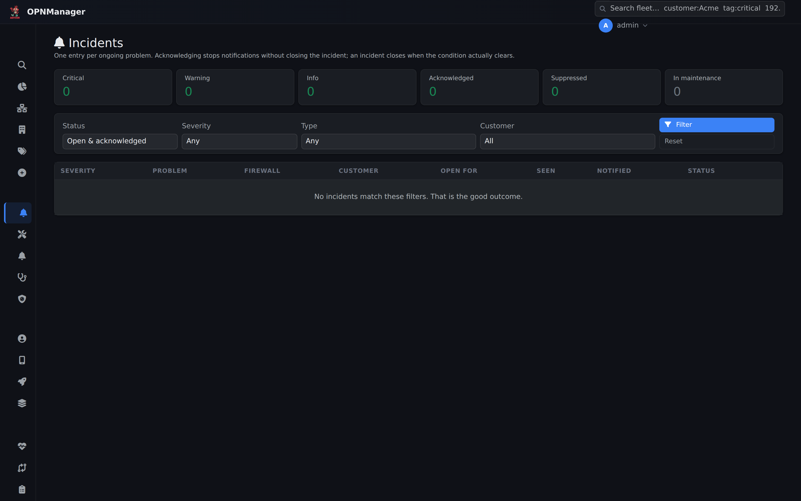

### Audit Log
Who did what, to which firewall, from where — filterable by action, user, firewall,
result and date range. Credential material is never recorded.

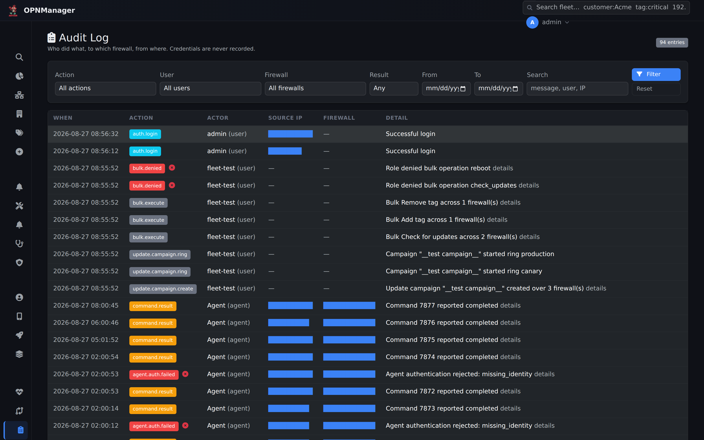

### Users and Roles
MSP staff accounts with the Administrator / Technician / Read Only roles.

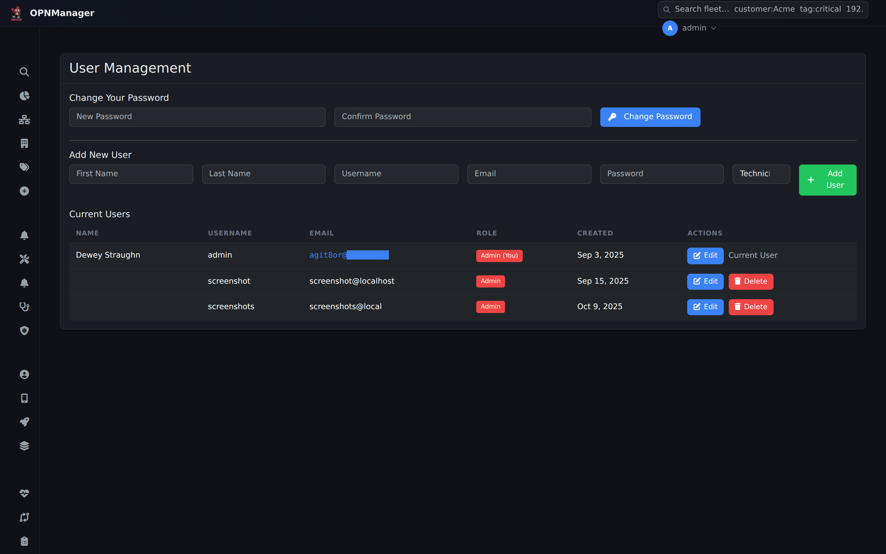

### Settings
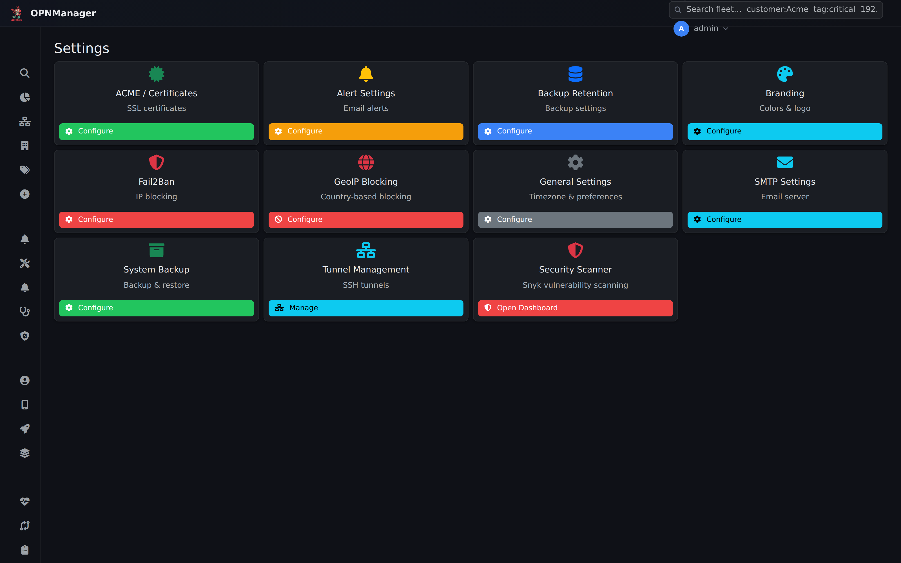

### About
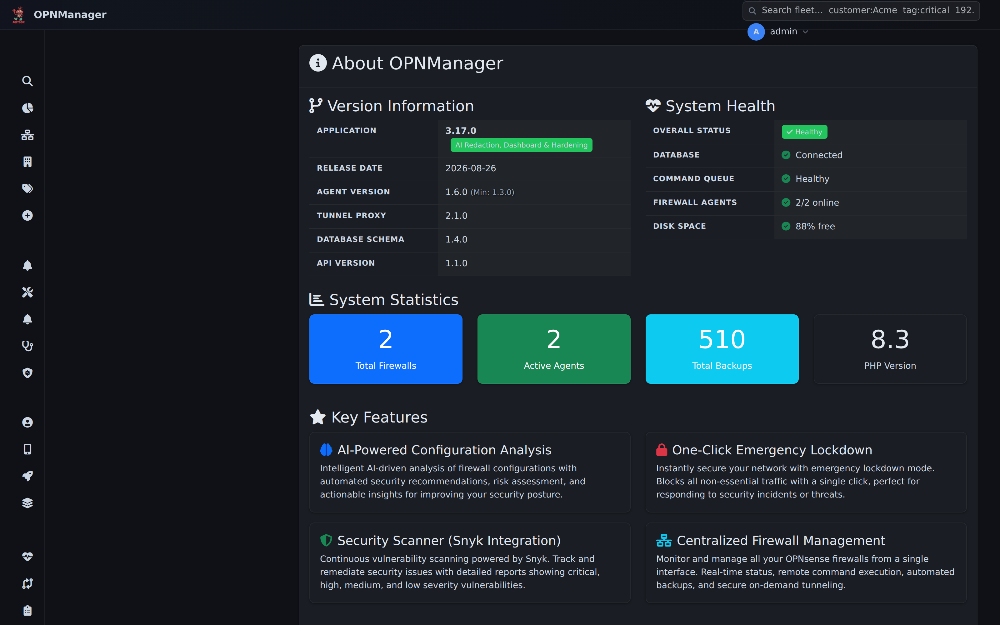

### Light Theme
Full light theme with system-preference detection and a manual toggle.

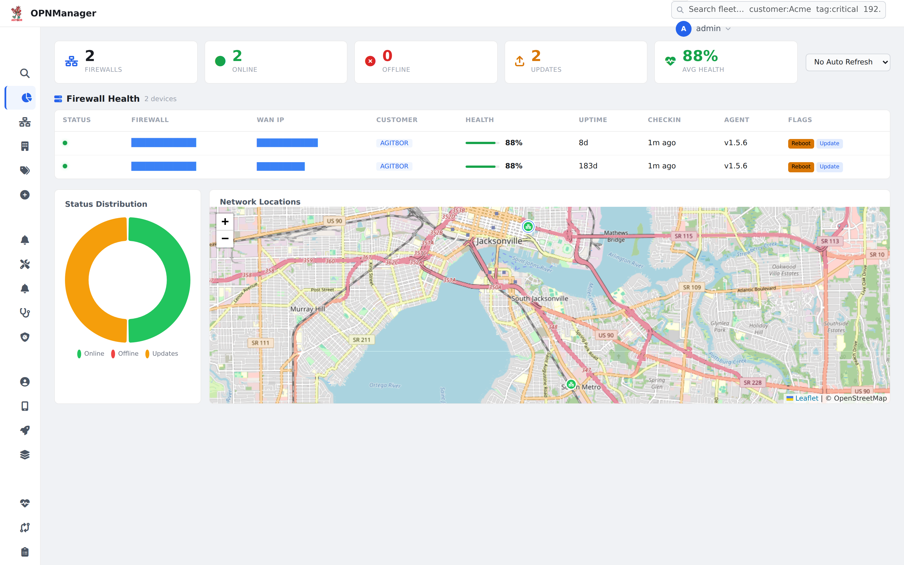

---

## System Requirements

### Server Requirements
- **OS**: Ubuntu 22.04 LTS or newer
- **PHP**: 8.0 or higher
- **MySQL/MariaDB**: 8.0+ / 10.6+
- **Web Server**: Apache 2.4+ or Nginx 1.18+
- **Disk Space**: Minimum 10GB (20GB+ recommended for backups)
- **Memory**: Minimum 2GB RAM (4GB+ recommended)

### Managed Firewalls
- **OPNsense**: 20.7+ (tested up to 25.7.x)
- **FreeBSD**: 13.x or 14.x
- **Connectivity**: Outbound HTTPS (443) access to manager server

---

## Quick Start

### 1. Server Installation

```bash
# Clone the repository
cd /var/www
git clone https://github.com/agit8or1/OPNMGR.git opnsense
cd /var/www/opnsense

# Install PHP dependencies
composer install --no-dev

# Import the database schema
# This creates the `opnsense_fw` database, all tables, and the reference data.
mysql -u root -p < database/schema.sql

# Create the application database user
mysql -u root -p -e "
  CREATE USER 'opnsense_user'@'localhost' IDENTIFIED BY 'your-secure-password';
  GRANT ALL PRIVILEGES ON opnsense_fw.* TO 'opnsense_user'@'localhost';
  FLUSH PRIVILEGES;"

# Configure the application
cp .env.example .env
# Edit .env and set at minimum DB_HOST, DB_NAME, DB_USER, DB_PASS and APP_URL
chmod 640 .env

# Create the first administrator account
php scripts/create_admin.php

# Set proper permissions
chown -R www-data:www-data /var/www/opnsense
chmod 755 /var/www/opnsense

# Configure Apache virtual host and reload
a2ensite opnmanager
systemctl reload apache2
```

> **Note:** the schema is safe to re-import — every statement is idempotent.
> To regenerate it from an existing installation, run `scripts/generate_schema.sh`.

### 2. Firewall Enrollment

#### Option A: Quick Enrollment (Recommended)

1. Log into OPNManager web interface
2. Navigate to **Firewalls > Add Firewall**
3. Generate an enrollment key
4. On the OPNsense firewall, run the one-liner install command shown on the page

#### Option B: Manual Plugin Installation

```bash
# On the OPNsense firewall, install the agent plugin:
fetch -o - https://<your-opnmgr-server>/downloads/plugins/install_opnmanager_agent.sh | sh
```

Then configure the agent via the OPNsense web GUI under **Services > OPNManager Agent**.

### 3. Agent Plugin

The OPNManager agent installs as a native OPNsense plugin:

- **Plugin location**: `/usr/local/opnsense/scripts/OPNsense/OPNManagerAgent/agent.sh`
- **Configuration**: Via OPNsense GUI (Services > OPNManager Agent)
- **Service management**: `service opnmanager_agent start|stop|restart`
- **Logs**: `/var/log/opnmanager_agent.log`
- **Auto-update**: Agent checks for updates on each check-in and self-updates

---

## Configuration

### Agent Check-in

The agent checks in every 2 minutes by default. On each check-in, it reports:
- System stats (CPU, memory, disk)
- Network interface status and traffic counters
- Latency measurements
- OPNsense version and update availability
- Pending command results

### Traffic Counter Intelligence

The agent uses the best available counter source:
- **Link layer** (default): Captures all traffic including forwarded/NAT
- **pf counters** (fallback): Used when Link-layer counters are frozen (common with virtio_net on VPS)
- **IP layer** (last resort): Per-address traffic only

---

## Security

### Authentication
- Secure password hashing (PHP `password_hash`)
- Session management with CSRF protection
- Login attempt logging

### Agent Communication
- HTTPS-only agent check-ins
- Hardware ID-based firewall identification
- Base64-encoded command payloads
- PID file locking prevents duplicate agents

### Secure Connections
- On-demand SSH reverse tunnels (dynamic port allocation 8100-8200)
- No exposed firewall ports required
- Automatic tunnel session cleanup

---

## Troubleshooting

### Agent Not Checking In

```bash
# On the OPNsense firewall:
service opnmanager_agent status
tail -20 /var/log/opnmanager_agent.log
```

### Network Data Shows Incorrect Values

- Ensure agent is v1.5.6+ (supports pf counter fallback for virtio_net)
- Check agent log for "Link layer counter frozen" messages
- Traffic data accumulates over time; new installations need ~24h for full graphs

---

## License

This project is licensed under the MIT License - see the [LICENSE](LICENSE) file for details.

---

## Support

- Star this repo on [GitHub](https://github.com/agit8or1/OPNMGR)
- Visit [mspreboot.com](https://mspreboot.com)
