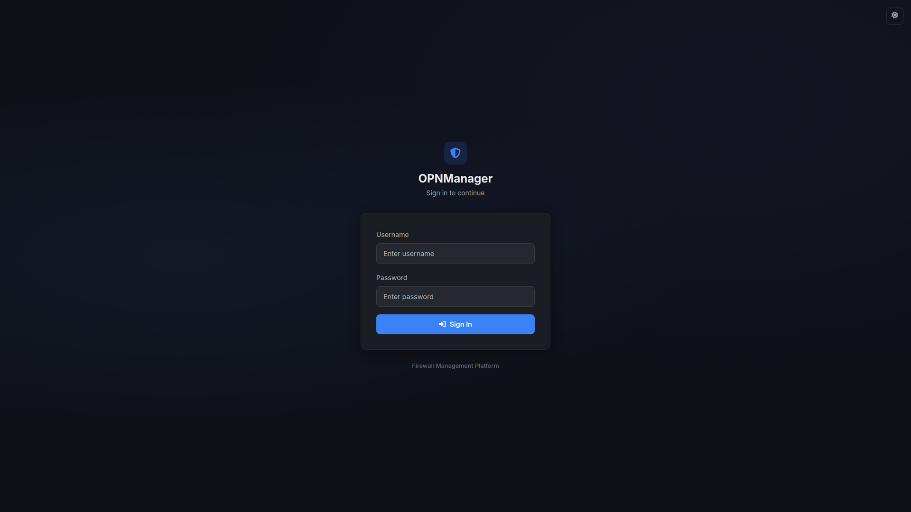
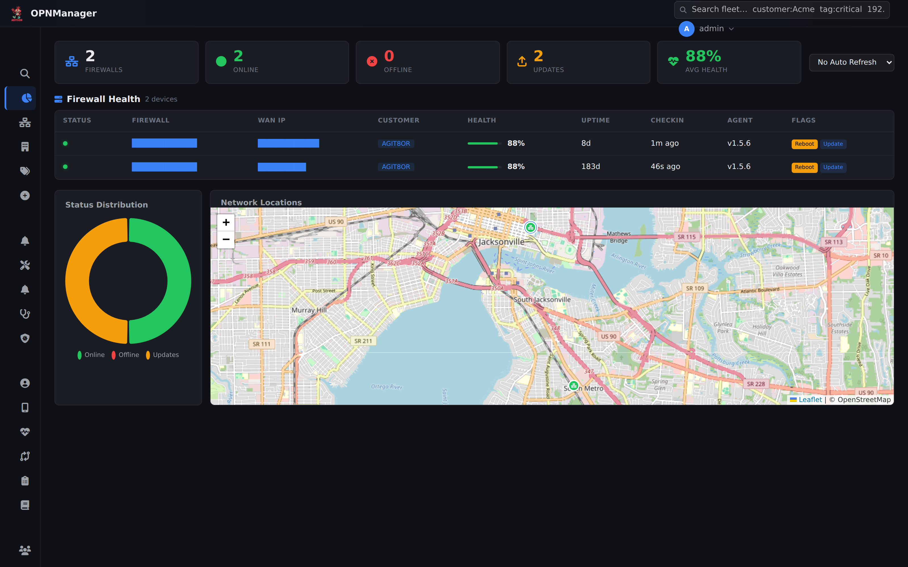
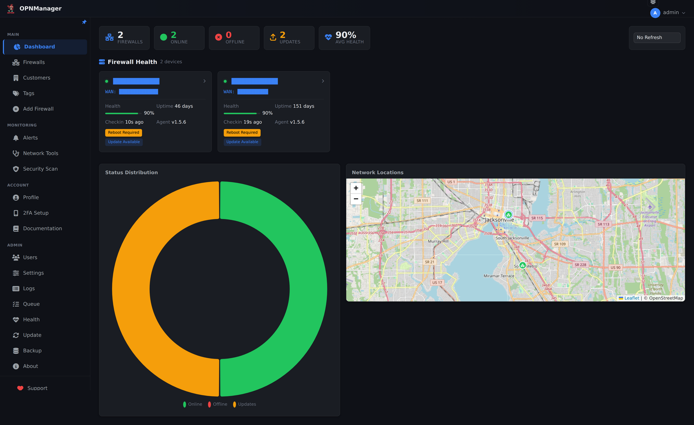
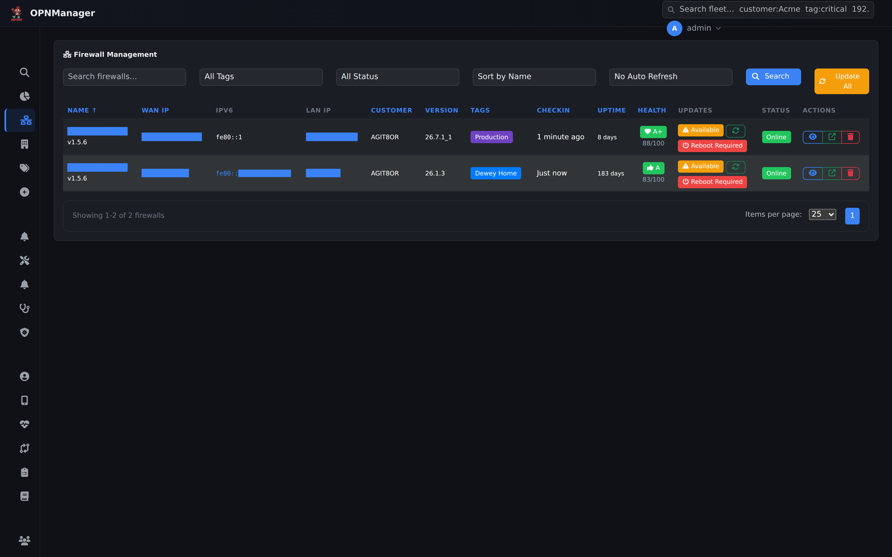
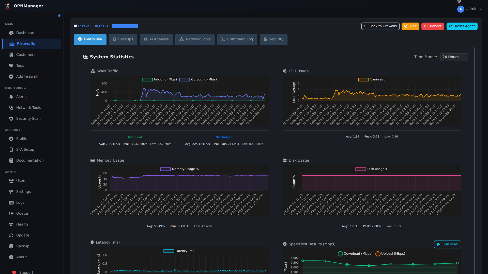
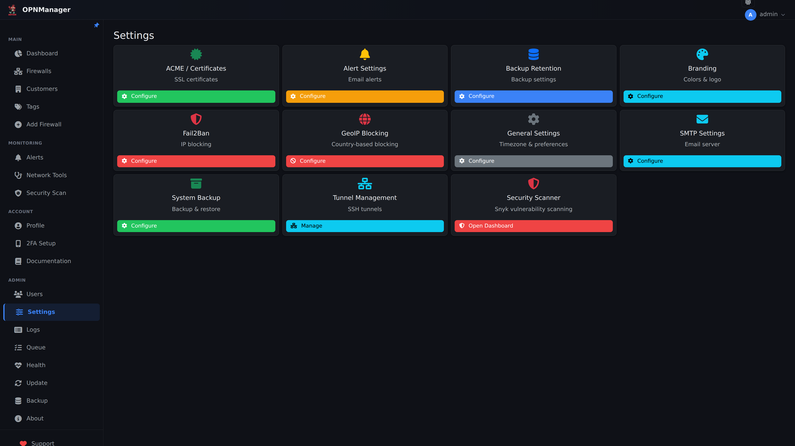
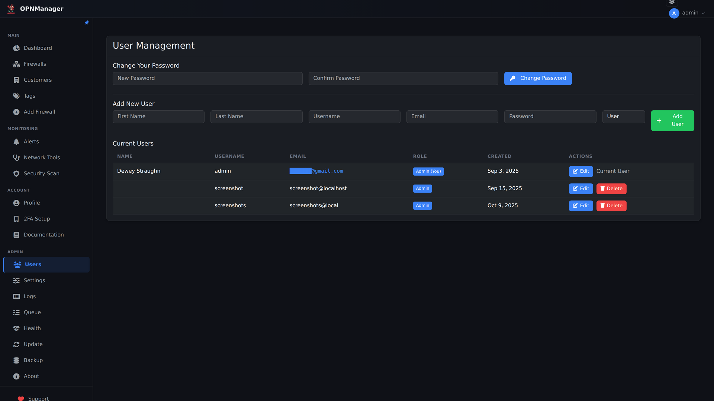
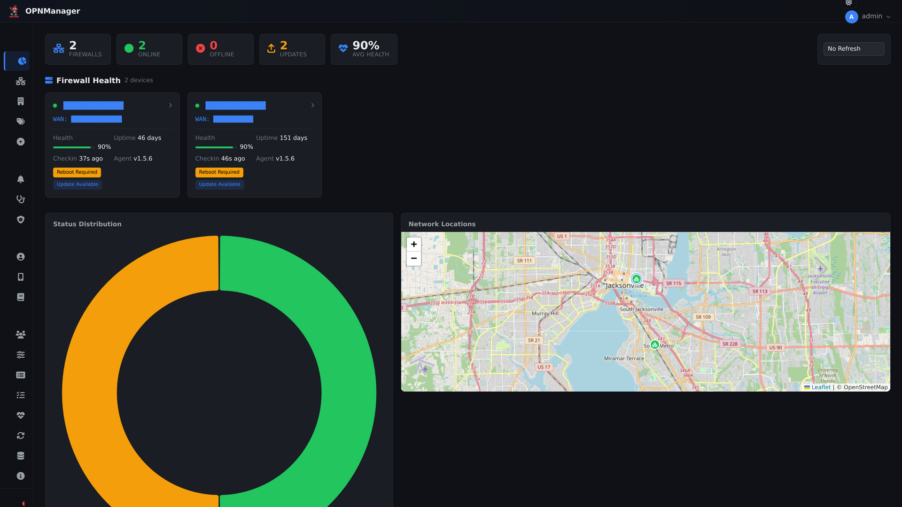
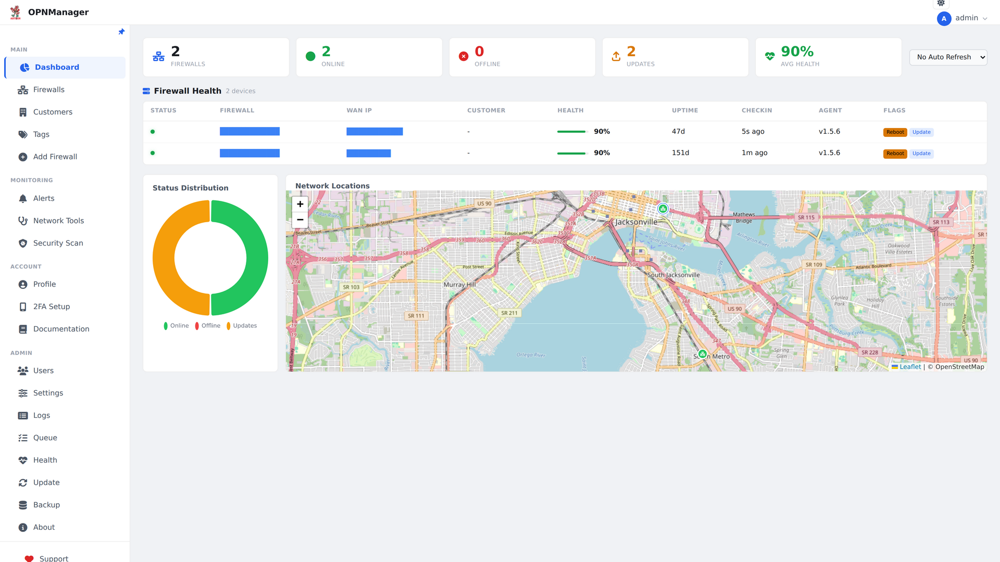

# OPNManager - OPNsense Firewall Management Platform

[](https://github.com/agit8or1/OPNMGR/stargazers)

**Status**: Production Stable | **License**: MIT | **Version**: [](https://github.com/agit8or1/OPNMGR/releases) | **Agent**: v1.4.0

A comprehensive web-based management platform for centralized monitoring, configuration, and maintenance of OPNsense firewalls.

If you find OPNManager useful, please consider giving it a star on GitHub — it helps others discover the project!

### New in v3.11 — Complete UI Redesign

OPNManager v3.11 features a ground-up UI redesign inspired by Datadog and Grafana:

- **Collapsible icon sidebar** — slim 72px rail that expands on hover, pin to keep open
- **Firewall health grid dashboard** — at-a-glance health cards for every firewall with status dots, health bars, uptime, and last checkin
- **Dark + Light themes** — system-preference aware with manual toggle, consistent across all pages
- **KPI metric strip** — compact pills showing total firewalls, online/offline counts, updates needed, and average health score
- **Professional design system** — 1,600+ lines of CSS with custom properties, no more inline styles
- **Security hardening** (v3.10) — 25+ endpoints secured with authentication, CSRF on 19+ forms, dependency updates

---

## Key Features

### Firewall Management
- **Centralized Dashboard**: Monitor all firewalls from a single interface
- **Real-time Status**: Live agent check-ins every 2 minutes
- **Plugin Agent**: Native OPNsense plugin with auto-update support
- **Health Monitoring**: CPU, memory, disk, uptime, network status
- **Tag System**: Organize firewalls with color-coded tags
- **Customer Grouping**: Multi-tenant support with customer organization

### Network & Traffic Monitoring
- **WAN Traffic Charts**: Real-time throughput graphs with auto-scaling (Mb/s / Gb/s)
- **Interface Status**: Per-interface RX/TX byte counters with error tracking
- **Latency Monitoring**: Continuous ping measurement to multiple targets
- **Bandwidth Testing**: On-demand iperf3 speed tests with multi-server fallback
- **Smart Counter Detection**: Automatic fallback to pf counters when driver-level counters are broken (virtio_net)

### System Monitoring
- **Accurate Uptime Tracking**: Real system uptime from agent
- **Version Tracking**: OPNsense version, agent version, available updates
- **One-Click Updates**: Trigger OPNsense updates with animated progress status
- **Reboot Control**: Clickable "Reboot Required" badge triggers remote reboot with confirmation
- **Stuck Update Recovery**: Auto-recovery for updates stuck >15 minutes
- **System Stats**: CPU, memory, disk usage charts (1h, 4h, 12h, 24h, 1w, 30d timeframes)

### Command Execution
- **Remote Command Queue**: Execute commands on firewalls remotely
- **Base64 Encoding**: Support for complex multi-line commands
- **Command History**: Track all executed commands with timestamps
- **Output Capture**: View command results in real-time

### Configuration Backup
- **Automated Backups**: Scheduled configuration backups
- **Manual Backups**: On-demand backup creation
- **Backup Management**: Download, restore, and delete backups
- **Retention Policies**: Automatic cleanup of old backups

### AI-Powered Security Analysis
- **Intelligent Configuration Review**: AI-driven analysis of firewall configurations
- **Security Recommendations**: Automated suggestions for improving security posture
- **Risk Assessment**: Identify potential vulnerabilities and misconfigurations

### Secure Connectivity
- **On-Demand SSH Tunnels**: Dynamic reverse tunnels with no exposed ports
- **Web Proxy**: Access firewall web UI through the manager
- **Automatic Cleanup**: Tunnel sessions timeout and clean up automatically

---

## Screenshots

### Login
Clean, minimal login with dark/light theme support.



### Dashboard — Firewall Health Grid
At-a-glance monitoring with KPI strip, health cards per firewall, status chart, and network map.



### Dashboard — Full View


### Firewall Management
Sortable, filterable firewall list with health scores and status indicators.



### Firewall Details
Detailed firewall view with charts, network info, and management tools.



### Settings
System configuration with ACME, alerts, backup, branding, Fail2Ban, and GeoIP.



### Users
Admin user management with roles, password changes, and CSRF protection.



### Collapsed Sidebar
Icon-only rail (72px) — hover or pin to expand.



### Light Mode
Full light theme with system-preference detection and manual toggle.



---

## System Requirements

### Server Requirements
- **OS**: Ubuntu 22.04 LTS or newer
- **PHP**: 8.0 or higher
- **MySQL/MariaDB**: 8.0+ / 10.6+
- **Web Server**: Apache 2.4+ or Nginx 1.18+
- **Disk Space**: Minimum 10GB (20GB+ recommended for backups)
- **Memory**: Minimum 2GB RAM (4GB+ recommended)

### Managed Firewalls
- **OPNsense**: 20.7+ (tested up to 25.7.x)
- **FreeBSD**: 13.x or 14.x
- **Connectivity**: Outbound HTTPS (443) access to manager server

---

## Quick Start

### 1. Server Installation

```bash
# Clone the repository
cd /var/www
git clone https://github.com/agit8or1/OPNMGR.git opnsense

# Set proper permissions
chown -R www-data:www-data /var/www/opnsense
chmod 755 /var/www/opnsense

# Import database schema
mysql -u root -p < /var/www/opnsense/database/schema.sql

# Configure database connection
cp /var/www/opnsense/inc/db.php.example /var/www/opnsense/inc/db.php
# Edit inc/db.php with your DB_HOST, DB_NAME, DB_USER, DB_PASS

# Configure Apache virtual host and reload
a2ensite opnmanager
systemctl reload apache2
```

### 2. Firewall Enrollment

#### Option A: Quick Enrollment (Recommended)

1. Log into OPNManager web interface
2. Navigate to **Firewalls > Add Firewall**
3. Generate an enrollment key
4. On the OPNsense firewall, run the one-liner install command shown on the page

#### Option B: Manual Plugin Installation

```bash
# On the OPNsense firewall, install the agent plugin:
fetch -o - https://<your-opnmgr-server>/downloads/plugins/install_opnmanager_agent.sh | sh
```

Then configure the agent via the OPNsense web GUI under **Services > OPNManager Agent**.

### 3. Agent Plugin

The OPNManager agent installs as a native OPNsense plugin:

- **Plugin location**: `/usr/local/opnsense/scripts/OPNsense/OPNManagerAgent/agent.sh`
- **Configuration**: Via OPNsense GUI (Services > OPNManager Agent)
- **Service management**: `service opnmanager_agent start|stop|restart`
- **Logs**: `/var/log/opnmanager_agent.log`
- **Auto-update**: Agent checks for updates on each check-in and self-updates

---

## Configuration

### Agent Check-in

The agent checks in every 2 minutes by default. On each check-in, it reports:
- System stats (CPU, memory, disk)
- Network interface status and traffic counters
- Latency measurements
- OPNsense version and update availability
- Pending command results

### Traffic Counter Intelligence

The agent uses the best available counter source:
- **Link layer** (default): Captures all traffic including forwarded/NAT
- **pf counters** (fallback): Used when Link-layer counters are frozen (common with virtio_net on VPS)
- **IP layer** (last resort): Per-address traffic only

---

## Security

### Authentication
- Secure password hashing (PHP `password_hash`)
- Session management with CSRF protection
- Login attempt logging

### Agent Communication
- HTTPS-only agent check-ins
- Hardware ID-based firewall identification
- Base64-encoded command payloads
- PID file locking prevents duplicate agents

### Secure Connections
- On-demand SSH reverse tunnels (dynamic port allocation 8100-8200)
- No exposed firewall ports required
- Automatic tunnel session cleanup

---

## Troubleshooting

### Agent Not Checking In

```bash
# On the OPNsense firewall:
service opnmanager_agent status
tail -20 /var/log/opnmanager_agent.log
```

### Network Data Shows Incorrect Values

- Ensure agent is v1.5.6+ (supports pf counter fallback for virtio_net)
- Check agent log for "Link layer counter frozen" messages
- Traffic data accumulates over time; new installations need ~24h for full graphs

---

## License

This project is licensed under the MIT License - see the [LICENSE](LICENSE) file for details.

---

## Support

- Star this repo on [GitHub](https://github.com/agit8or1/OPNMGR)
- Visit [mspreboot.com](https://mspreboot.com)
