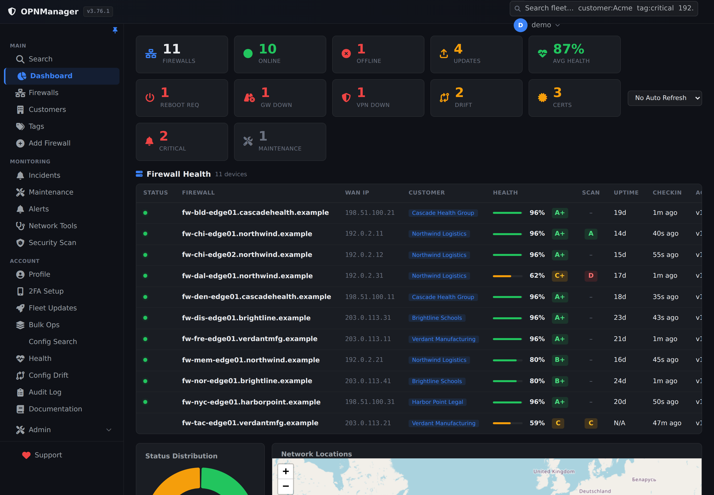
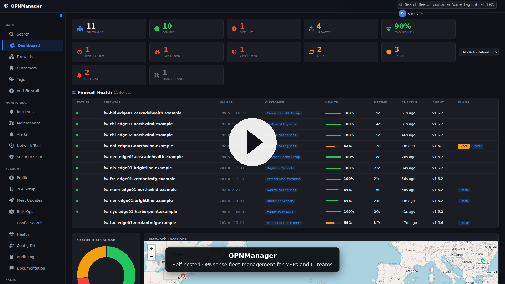
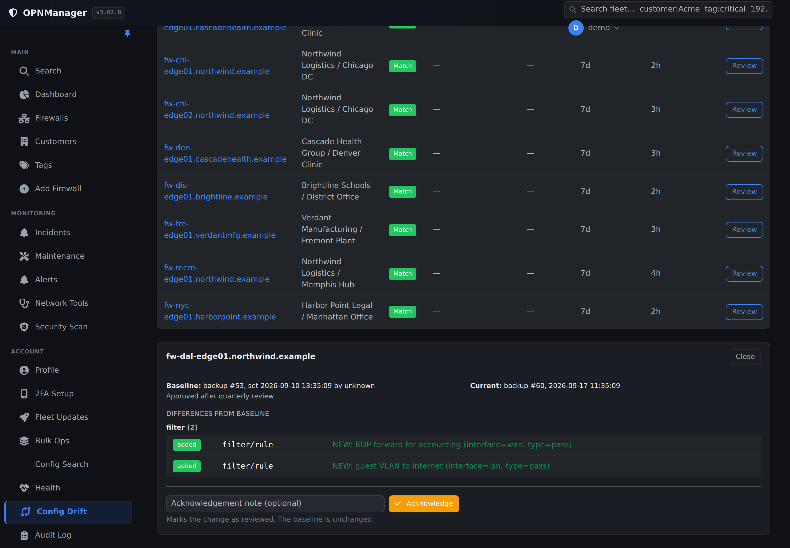
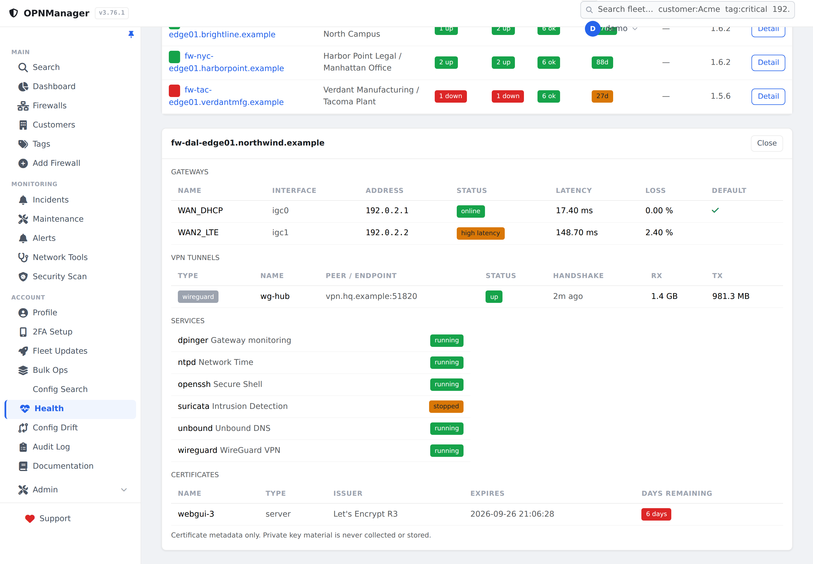
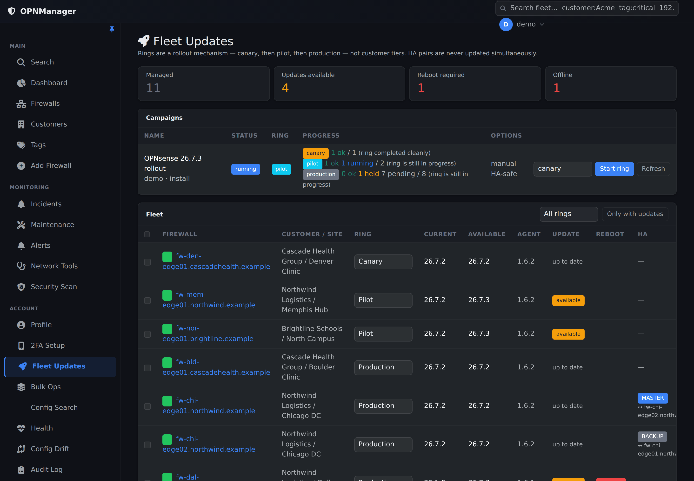
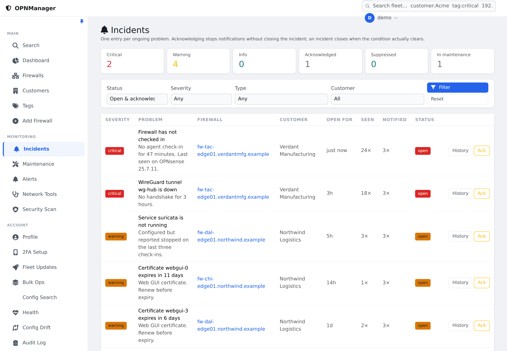
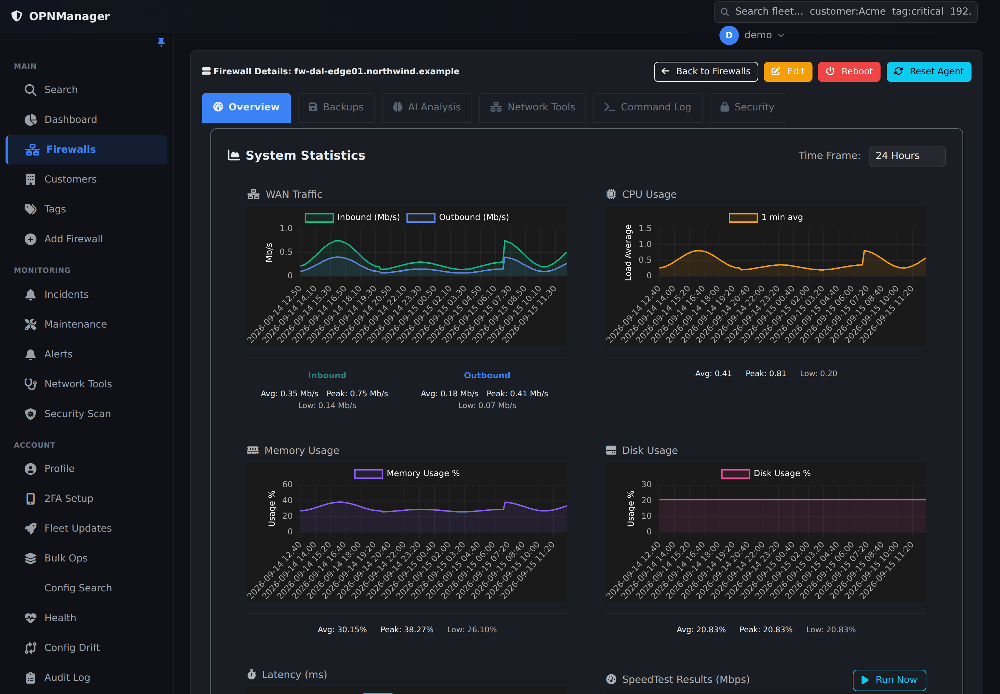
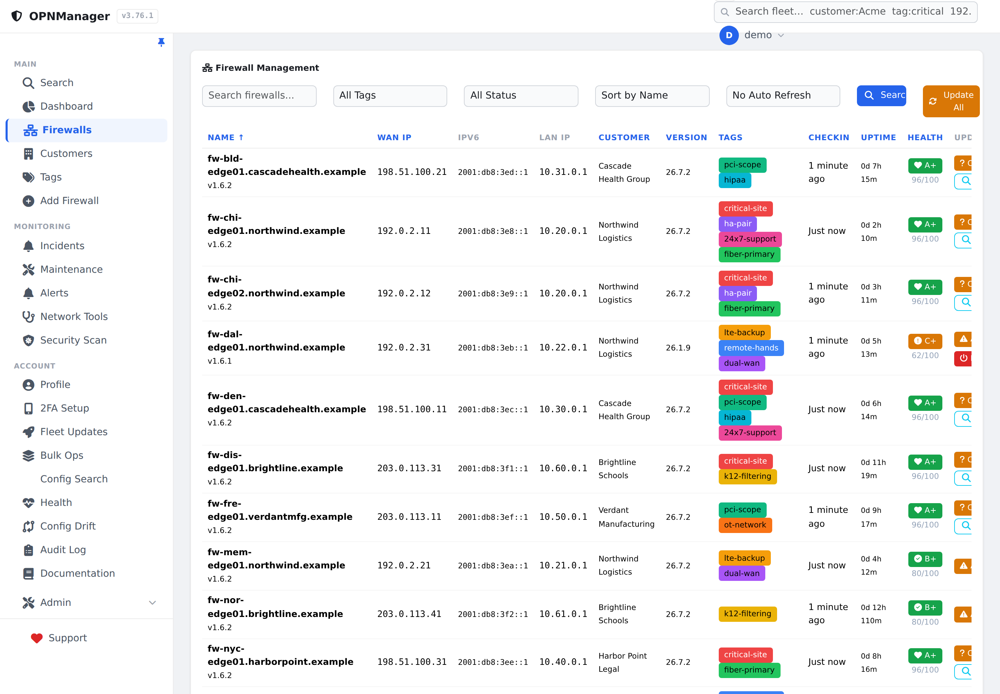

<div align="center">

# OPNManager

**Self-hosted OPNsense fleet management for MSPs and IT teams.**

[](https://github.com/agit8or1/OPNMGR/actions/workflows/ci.yml)
[](LICENSE)
[](CHANGELOG.md)

[Quick Start](#quick-start) ·
[Screenshots](docs/SCREENSHOTS.md) ·
[Watch the walkthrough](#watch-the-walkthrough) ·
[Documentation](#documentation) ·
[Security](SECURITY.md) ·
[MSPReboot](https://mspreboot.com)

</div>

OPNManager runs on your own server and gives your staff one place to watch, back up
and update every OPNsense firewall you look after, grouped by customer and site.
Customers and sites are organisational groupings inside your installation — they are
not tenant logins, and nobody outside your own team signs in.

[](docs/images/github/fleet-dashboard-dark.png)

<sub>All screenshots show the real interface populated with simulated data from an
isolated demo fixture. Addresses are reserved documentation ranges and every
organisation and hostname is fictitious.</sub>

---

## What it helps you do

**Find firewall and connectivity problems.** Agents report check-ins, gateway latency
and loss, VPN tunnel state, CARP status, service state and certificate expiry.
Problems become incidents — one entry per ongoing condition, opened when it starts and
closed when it actually clears, rather than one email per poll.

**Review configuration backups and changes.** Configurations are backed up on a
schedule and kept per firewall. Mark one as the approved baseline and every firewall
is compared against it, ignoring serialisation noise and the fields OPNsense rewrites
on every save. Nothing is ever restored automatically.

**Coordinate maintenance and updates.** Updates run as campaigns through canary, pilot
and production rings with manual progression. Members of a CARP pair are never updated
at the same time. Maintenance windows withhold notification while collection and
health display continue.

---

## Watch the walkthrough

[](https://github.com/agit8or1/OPNMGR/releases/download/v3.25.0/opnmanager-walkthrough-1080p.mp4)

A recorded tour of the running application — the fleet dashboard, finding a
connectivity problem, reviewing what changed against an approved baseline, planning a
ringed update, and the customer and site model, with a theme switch part way through.

**[▶ Watch the walkthrough](https://github.com/agit8or1/OPNMGR/releases/download/v3.25.0/opnmanager-walkthrough-1080p.mp4)** — 3m42s, 1080p MP4 (11 MB).
Prefer the short version? **[40-second highlight](https://github.com/agit8or1/OPNMGR/releases/download/v3.25.0/opnmanager-highlight-1080p.mp4)**.

<sub>These are pinned to the v3.25.0 release, which is where the media lives. They
were previously pointed at `releases/latest`, which broke the moment a later release
was published without the video attached.</sub>
Captions: [`docs/walkthrough.vtt`](docs/walkthrough.vtt) ·
Transcript: [`docs/walkthrough-script.md`](docs/walkthrough-script.md).
The video is caption-led; no narration audio was produced.

---

## See it in action

### Know exactly what changed, and when

Each firewall's newest backup is compared against the baseline you approved, and the
diff names every change by its description rather than by line number.

[](docs/images/github/config-diff-dark.png)

### Diagnose one firewall without leaving the page

Gateways with latency and loss, VPN tunnels with handshake age, service state and
certificate expiry — here a degraded LTE gateway and a stopped IDS service.

[](docs/images/github/firewall-health-light.png)

### Roll updates out without taking a customer down

Canary, then pilot, then production, with manual progression — and never both members
of a CARP pair at once.

[](docs/images/github/fleet-updates-dark.png)

### Work one list instead of an inbox

An incident opens when a condition becomes true and closes when it actually clears.
Acknowledging stops the notifications without closing it.

[](docs/images/github/incidents-light.png)

### See the trend, not just the current value

Per-firewall WAN throughput, CPU load, memory and disk, collected on each agent
check-in.

[](docs/images/github/firewall-statistics-dark.png)

### Organised the way you actually support them

Customers group sites, sites group firewalls, each with a code, timezone, contacts and
a default maintenance window.

[](docs/images/github/fleet-firewalls-light.png)

**[See all 28 screenshots →](docs/SCREENSHOTS.md)** — fleet health, config search,
backups, bulk operations, maintenance windows, staff roles, tags, approved commands,
audit history and more, in both themes.

---

## Quick Start

Requires Ubuntu 22.04 LTS or newer, PHP 8.0+ (CI builds against 8.3), MySQL 8.0+ or
MariaDB 10.6+, and Apache 2.4+ or Nginx 1.18+.

### 1. Server

```bash
cd /var/www
git clone https://github.com/agit8or1/OPNMGR.git opnsense
cd /var/www/opnsense

composer install --no-dev

# Creates the opnsense_fw database, every table and the reference data.
# Safe to re-import: every statement is idempotent.
mysql -u root -p < database/schema.sql

mysql -u root -p -e "
  CREATE USER 'opnsense_user'@'localhost' IDENTIFIED BY 'your-secure-password';
  GRANT ALL PRIVILEGES ON opnsense_fw.* TO 'opnsense_user'@'localhost';
  FLUSH PRIVILEGES;"

cp .env.example .env
# Set at minimum DB_HOST, DB_NAME, DB_USER, DB_PASS and APP_URL.
chmod 640 .env

# Required since 3.12: encrypts agent credentials and SSH keys at rest.
php scripts/generate_master_key.php

php scripts/create_admin.php

chown -R www-data:www-data /var/www/opnsense
a2ensite opnmanager && systemctl reload apache2
```

### 2. Agent

Sign in, open **Settings**, and copy the install one-liner shown there. It is built
from your own server's hostname:

```sh
# On the OPNsense firewall, as root:
fetch -o - https://<your-opnmgr-server>/downloads/plugins/install_opnmanager_agent.sh | sh
```

Then configure the agent under **Services → OPNManager Agent** in the OPNsense GUI.
The agent installs as a native plugin, checks in every two minutes by default, logs to
`/var/log/opnmanager_agent.log`, and is managed with
`service opnmanager_agent start|stop|restart`.

---

## Compatibility and feature availability

| | Version | Notes |
|---|---|---|
| Application | 3.51.0 | Install from `main`. |
| Agent | v1.6.7 | Newest published package. Not in this repo — see Known limitations. |
| Minimum supported agent | 1.3.0 | Not enforced at check-in: older agents still report in, but lose health score and version-gated features. |
| Database schema | 1.4.0 | `database/schema.sql`, regenerated by `scripts/generate_schema.sh`. |

CI enforces these against `VERSION` and the published artifact — application 3.51.0,
**Agent**: v1.6.7 — so no reference in the tree can drift out of step.

Feature availability depends on the agent version a firewall is actually running:

| Feature | Requires | Status |
|---|---|---|
| Check-ins, system stats, traffic, latency | agent 1.3.0+ | Released |
| Configuration backup, restore, drift | agent 1.3.0+ | Released |
| Fleet updates, rings, HA-safe ordering | agent 1.3.0+ | Released |
| Incidents and maintenance windows | server only | Released |
| Web GUI access restriction, outbound lockdown | agent 1.3.0+ | Released. Queued as a policy the agent applies; see the note below. |
| Health telemetry — gateways, VPN, CARP, services, certificates | agent 1.6.2+ | Released. 1.6.0 reported no gateways and 1.6.1 miscounted services; use 1.6.2. |
| AI configuration review | server only, opt-in | Released, off by default. Secrets are redacted before anything leaves your server and redaction cannot be disabled. |

Firewalls below the health minimum are shown as *not reporting* rather than as
failures. Anything present in this repository but not listed above should be treated
as source-only until it appears in [CHANGELOG.md](CHANGELOG.md).

**Validated on** OPNsense 26.7 (FreeBSD 14), which is what the maintainer's own fleet
runs. Earlier releases may work — the agent needs only a POSIX shell, `fetch` and
`configctl` — but are not tested. Firewalls need outbound HTTPS to the manager; no
inbound port is required.

### Known limitations

- **The agent package is not in this repository, and you have to put it on your own
  server.** `downloads/` holds release artifacts and is gitignored, so a fresh clone has
  no `os-opnmanager-agent-<version>.tar.gz` to serve. The installer fetches the package
  from *your* manager — it takes its base URL from whoever emits the install command
  (`OPNMGR_BASE_URL`) and refuses rather than guessing — so until you place the tarball
  in `downloads/plugins/` on your server, enrolment gets a 404 and stops. Build it from
  `plugin/os-opnmanager-agent/`, which is tracked.
- **Agent request signing is server-side only.** The manager verifies HMAC-SHA256
  signatures, provisions each agent a signing secret, and offers three fleet-wide policy
  modes — but no released agent produces a signature, and the agent does not store the
  secret it is sent. `agent_auth_mode` must stay at `compatibility`; setting
  `require_signed` refuses every check-in in the fleet. The interface warns when the
  configured policy cannot be satisfied.
- **The two firewall lockdown policies have not been exercised against a live
  OPNsense firewall by the maintainer of this change.** They edit `/conf/config.xml`,
  back it up first, validate the result before installing it, and restore the backup
  if the filter reload fails — and the generator is tested by running the real
  scripts against a sample configuration. But the effect on a production firewall is
  untested. Apply to one firewall you can reach out-of-band before using them across
  a fleet.
- **The project itself carries no LTS line or published release cadence.** Treat it
  as actively developed software and read the changelog before upgrading. (Commercial
  hosting and support are available separately — see [Support](#support).)

### Upgrading

`git pull` is usually enough. Since 3.26.0 the two-factor enrolment QR is rendered
on your own server, which added one Composer dependency — run
`composer install --no-dev` after pulling, or the two-factor setup page will fail to
load.

### Releases

Each version is tagged from `main`, so the
[latest release](https://github.com/agit8or1/OPNMGR/releases/latest) matches this tree.
Tagging was intermittent before 3.22 — v3.11.1 was the previous tag, and 3.12 through
3.21 shipped on `main` and are recorded only in the changelog — so
[CHANGELOG.md](CHANGELOG.md) remains the authoritative history.

---

## Documentation

| | |
|---|---|
| [docs/SCREENSHOTS.md](docs/SCREENSHOTS.md) | Full screenshot gallery — 28 captures in both themes. |
| [CHANGELOG.md](CHANGELOG.md) | Full release-by-release history. |
| [FEATURES.md](FEATURES.md) | Feature reference. |
| [docs/UPGRADING.md](docs/UPGRADING.md) | Upgrading the server and the agent fleet. |
| [SECURITY.md](SECURITY.md) | Security architecture and how to report a vulnerability. |
| [docs/walkthrough-script.md](docs/walkthrough-script.md) | Walkthrough transcript and narration script. |

---

## Security

Agents authenticate with a per-firewall API key and HMAC signing secret. Secrets, SSH
private keys and MFA recovery codes are encrypted at rest with XChaCha20-Poly1305
keyed from `.env`. Agent updates are Ed25519-signed and verified before installation,
with automatic rollback. Remote operations go through a validated action catalogue;
raw shell is a separate, audited, explicitly privileged path. Certificate metadata is
collected, never private key material.

Read [SECURITY.md](SECURITY.md) before exposing an installation, and report
vulnerabilities through the process described there rather than in a public issue.

## Contributing

Issues and pull requests are welcome — there are
[templates](https://github.com/agit8or1/OPNMGR/issues/new/choose) for bugs, features
and questions. CI lints every PHP and shell file, validates Composer dependencies,
runs the security regression suite, and enforces that `VERSION` and every version
reference derived from it agree.

## Support

- [Issues](https://github.com/agit8or1/OPNMGR/issues) for bugs and questions
- **Managed hosting and paid support are available** — see
  [mspreboot.com](https://mspreboot.com) or
  [get in touch](https://mspreboot.com/contact)

OPNManager itself stays free, MIT-licensed and self-hosted. Nothing in the project
requires an engagement, and everything documented here works without one.

---

## More tools from MSPReboot

OPNManager is one of six free, self-hosted tools published at
**[mspreboot.com/free-projects](https://mspreboot.com/free-projects)** — alongside
Client St0r (IT documentation and asset management), Depl0y, St0r, Rem0te and
Net Agit8or. They are free to use and self-hosted, with no per-seat billing and no
licence server.

[mspreboot.com](https://mspreboot.com) is the MSP consulting practice of the same
author, who ran an MSP for 24 years. If you would rather not run OPNManager yourself,
**hosting and support for it are offered there**, as is consulting on the operation
around it. Use of the software never depends on any of that — the project is free and
self-hosted either way.

## License

MIT — see [LICENSE](LICENSE).

---

<sub>OPNManager is an independent project. It is not affiliated with, endorsed by, or
sponsored by Deciso B.V. or the OPNsense project. "OPNsense" is a registered trademark
of Deciso B.V.</sub>
