# OPNManager System Architecture Flowchart

## 🏗️ COMPLETE APPLICATION FLOW DIAGRAM

```mermaid
graph TB
    subgraph "Frontend Layer"
        UI[Web Interface - Bootstrap/Chart.js]
        FD[firewall_details.php - 2706 lines]
        AUTH[Authentication System]
    end
    
    subgraph "API Layer - /var/www/opnsense/api/"
        AC[agent_checkin.php - Agent Communication]
        GTS[get_traffic_stats.php - ✅ WORKING]
        GSS[get_system_stats.php - ❌ HANGING]
        GLS[get_latency_stats.php - ❌ AUTH REQUIRED]
        GSR[get_speedtest_results.php - ❌ AUTH REQUIRED]
    end
    
    subgraph "Database Layer - MySQL opnsense_fw"
        FW[firewalls table]
        FA[firewall_agents table - 1 record v3.6.1]
        FTS[firewall_traffic_stats - 1,427 records]
        FSS[firewall_system_stats - working]
        FL[firewall_latency - ❌ EMPTY]
        FS[firewall_speedtest - ❌ EMPTY]
        ACH[agent_checkins - ❌ EMPTY TABLE]
    end
    
    subgraph "Remote Firewall - 73.35.46.112"
        A1[Agent v3.5.2 - :00 checkin]
        A2[Agent v3.6.1 - :03 checkin]
        OPN[OPNsense OS]
    end
    
    subgraph "Agent Update System - ❌ FAILING"
        DL[/downloads/ - v3.7.0 available]
        UP[update_agent.sh - not executing]
        FORCE[Force Update Commands - ignored]
    end
    
    %% Data Flow
    UI --> FD
    FD --> AUTH
    FD --> GTS
    FD --> GSS
    FD --> GLS  
    FD --> GSR
    
    GTS --> FTS
    GSS --> FSS
    GLS --> FL
    GSR --> FS
    
    A1 --> AC
    A2 --> AC
    AC --> FA
    AC --> FTS
    AC --> FSS
    AC --> ACH
    
    AC --> FORCE
    FORCE --> A1
    FORCE --> A2
    
    %% Issue Indicators
    GSS -.->|HANGS| X1[❌ System Charts Empty]
    GLS -.->|AUTH ERROR| X2[❌ Latency Charts Empty]
    GSR -.->|AUTH ERROR| X3[❌ SpeedTest Charts Empty]
    A1 -.->|IGNORES UPDATES| X4[❌ Multiple Agents]
    A2 -.->|IGNORES UPDATES| X4
    ACH -.->|NO DATA| X5[❌ No Audit Trail]
    
    %% Success Path
    GTS --> C1[✅ Traffic Charts Working]
    FTS --> C1
```

## 🔄 AGENT COMMUNICATION SEQUENCE


## 📊 CHART DATA PIPELINE

```mermaid
graph LR
    subgraph "Data Collection"
        AGENT[Agents] --> STATS[System Stats]
        AGENT --> TRAFFIC[Traffic Stats] 
        MISSING[❌ Missing] --> LATENCY[Latency Tests]
        MISSING --> SPEEDTEST[Speed Tests]
    end
    
    subgraph "Database Storage"
        STATS --> DB1[firewall_system_stats ✅]
        TRAFFIC --> DB2[firewall_traffic_stats ✅]
        LATENCY --> DB3[firewall_latency ❌ Empty]
        SPEEDTEST --> DB4[firewall_speedtest ❌ Empty]
    end
    
    subgraph "API Processing"
        DB1 --> API1[get_system_stats.php ❌ Hangs]
        DB2 --> API2[get_traffic_stats.php ✅ Working]
        DB3 --> API3[get_latency_stats.php ❌ Auth Error]
        DB4 --> API4[get_speedtest_results.php ❌ Auth Error]
    end
    
    subgraph "Frontend Display"
        API1 --> CHART1[System Charts ❌ Empty]
        API2 --> CHART2[Traffic Charts ✅ Working]
        API3 --> CHART3[Latency Charts ❌ Empty]
        API4 --> CHART4[SpeedTest Charts ❌ Empty]
    end
```



## 🚨 ISSUE DEPENDENCY MAP


## 🔧 SOLUTION ARCHITECTURE


## 📋 CRITICAL FILE LOCATIONS & MODIFICATIONS NEEDED

### Files Requiring Immediate Attention
```
🔴 CRITICAL:
/var/www/opnsense/agent_checkin.php (Lines 407-440)
├── Issue: Agents ignore update commands
├── Fix: Add HTTP 500 response for old agents
└── Priority: P1 - Agent consolidation

/var/www/opnsense/api/get_system_stats.php (Entire file)
├── Issue: Hangs on execution  
├── Fix: Add timeouts, error handling
└── Priority: P2 - Chart functionality

🟡 HIGH:
/var/www/opnsense/api/get_latency_stats.php (Lines 7-15)
├── Issue: Authentication required
├── Fix: Bypass for local requests
└── Priority: P2 - Chart data

/var/www/opnsense/api/get_speedtest_results.php (Lines 7-15) 
├── Issue: Authentication required
├── Fix: Bypass for local requests  
└── Priority: P2 - Chart data

🟢 WORKING (Reference):
/var/www/opnsense/api/get_traffic_stats.php
├── Status: Successfully fixed
└── Use as template for other APIs
```

### Database Schema Fixes Required
```sql
-- Fix agent_checkins logging
ALTER TABLE agent_checkins ADD COLUMN IF NOT EXISTS 
    response_data TEXT AFTER checkin_data;

-- Ensure latency table structure
ALTER TABLE firewall_latency 
    MODIFY measured_at TIMESTAMP DEFAULT CURRENT_TIMESTAMP;

-- Ensure speedtest table structure  
ALTER TABLE firewall_speedtest
    MODIFY test_date TIMESTAMP DEFAULT CURRENT_TIMESTAMP;

-- Clean up bad data
DELETE FROM firewall_traffic_stats 
WHERE bytes_in > 1000000000 OR bytes_out > 1000000000;
```

## 🎯 IMMEDIATE NEXT STEPS FOR CLAUDE CODER

### Step 1: Agent Consolidation (30 minutes)
```bash
# Create emergency agent fix script
cat > /var/www/opnsense/emergency_agent_fix.php << 'EOF'
<?php
// Force HTTP 500 error for old agents to trigger restart/update
if (isset($_POST['agent_version'])) {
    $version = $_POST['agent_version'];
    if (version_compare($version, '3.7.0', '<')) {
        http_response_code(500);
        echo json_encode(['error' => 'FORCE_RESTART_UPDATE']);
        exit;
    }
}
EOF
```

### Step 2: Fix Chart APIs (45 minutes)  
```php
// Add to each chart API after line 8:
if ($_SERVER['REMOTE_ADDR'] === '127.0.0.1' || 
    $_SERVER['HTTP_HOST'] === 'localhost' ||
    strpos($_SERVER['HTTP_USER_AGENT'], 'curl') !== false) {
    // Skip authentication for local/testing requests
    $bypass_auth = true;
}

if (!$bypass_auth && !isLoggedIn()) {
    // Regular authentication check
}
```

### Step 3: System Stats Timeout (15 minutes)
```php
// Add to get_system_stats.php at top:
ini_set('max_execution_time', 10);
set_time_limit(10);
$DB->setAttribute(PDO::ATTR_TIMEOUT, 5);
```

This comprehensive technical handoff provides Claude Coder with complete context to take over and resolve all outstanding issues systematically.