# Screenshots

Every image below is the real OPNManager interface. The data in it is not real: it
comes from `scripts/demo_fixture.php`, which populates a throwaway database with
fictitious customers, sites and simulated telemetry and refuses to run against
anything else. Addresses are reserved documentation ranges (RFC 5737, RFC 3849) and
hostnames use the reserved `.example` domain (RFC 6761). No live firewall is
contacted to produce them, and no update, reboot or restore is triggered.

All captures are 1440×900. Dark theme except where noted. Click any image for
full size.

[← Back to the README](../README.md) · [How these are regenerated](images/github/README.md)

## Walkthrough

A minute through the fleet dashboard, the firewall list, fleet search, one firewall's
health, configuration drift, a rollout in progress, incidents, and the customer/site
model.

[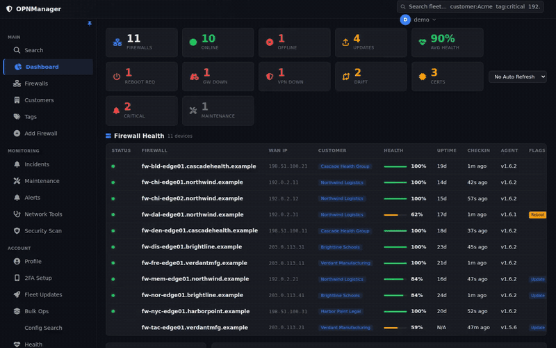](images/github/walkthrough.gif)

A higher-quality 1440×900 MP4 of the same walkthrough is attached to the
[latest release](https://github.com/agit8or1/OPNMGR/releases/latest).

## The fleet

### Dashboard

Roll-up tiles appear only when non-zero, so an uneventful fleet is a short page. Here
one firewall is offline, four have updates pending, two have drifted from baseline and
three certificates are inside the warning window.

### Firewall list

Sortable and filterable, with colour-coded tags, health score, per-device version and
agent version.

[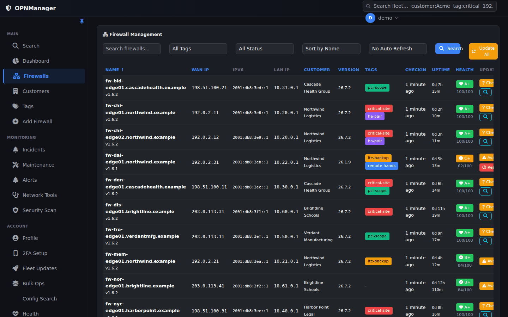](images/github/fleet-firewalls.png)

### Fleet search

One box across the whole fleet. Qualifiers (`customer:`, `site:`, `tag:`, `version:`,
`agent:`, `ip:`, `interface:`, `vpn:`, `status:`) combine with AND, and a bare CIDR
matches any firewall with an address inside it.

[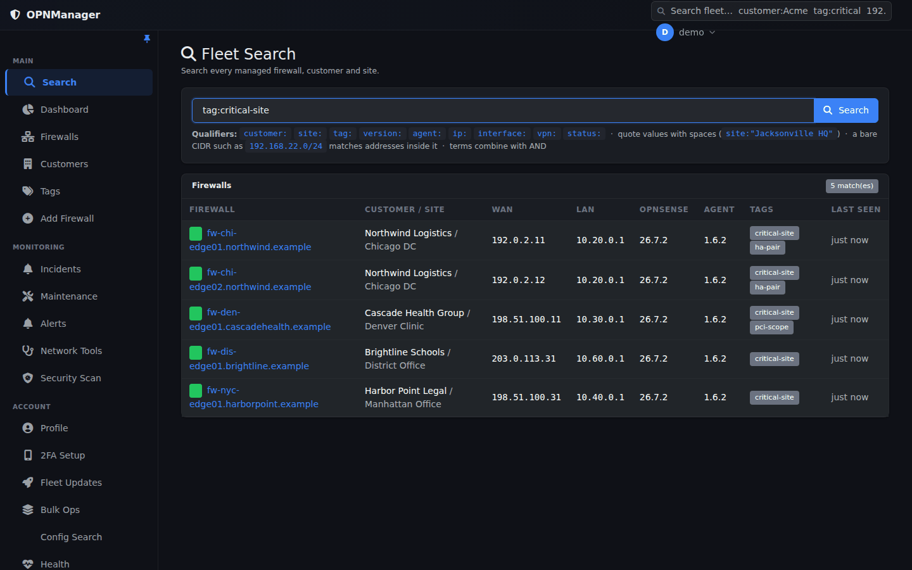](images/github/fleet-search.png)

### Customers and sites

Customers group sites, sites group firewalls. These are organisational containers:
they carry a code, timezone, tags, contacts and a default maintenance window, and they
have no accounts and no login.

[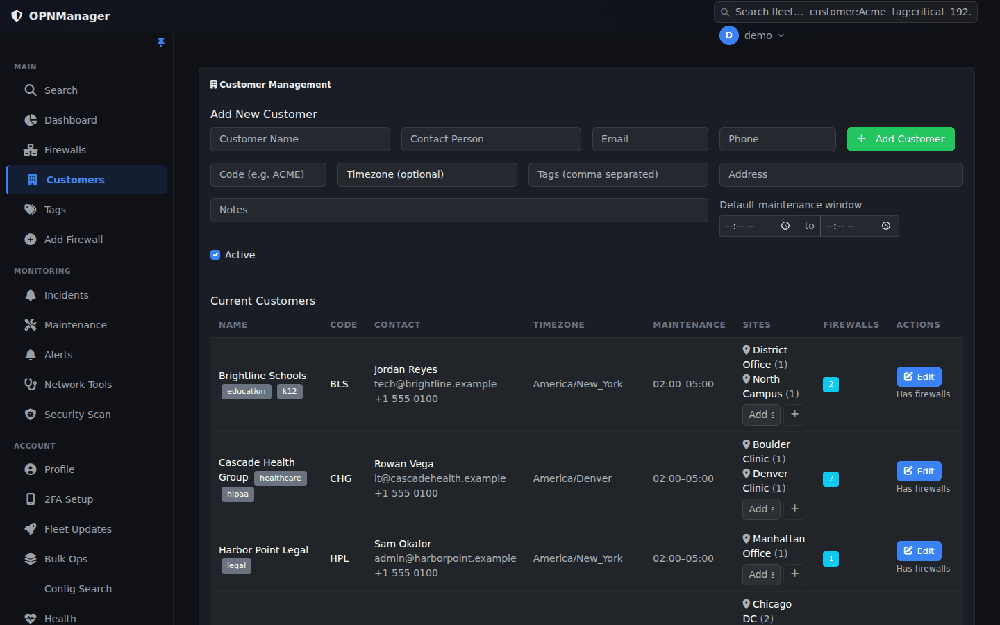](images/github/customers.png)

## Health and problems

### Health overview

Fleet-wide counts of gateways down and degraded, tunnels down, services stopped and
certificates expiring, with the certificates inside 30 days listed and per-firewall
agent authentication state.

[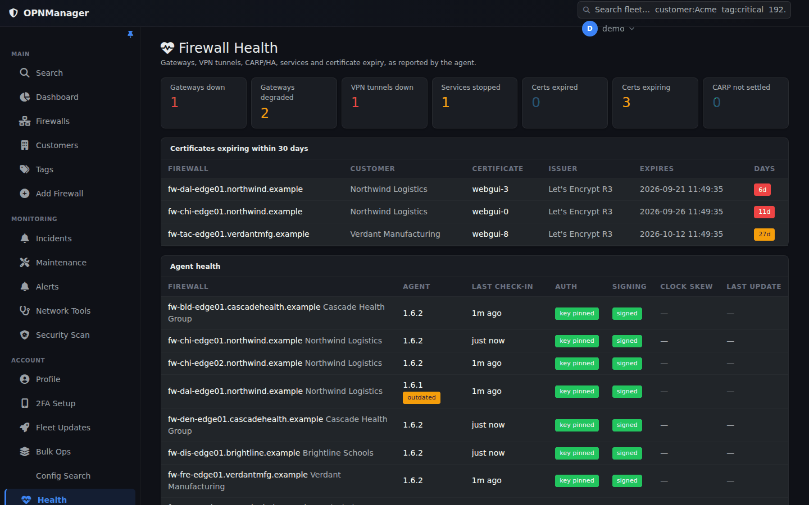](images/github/health-overview.png)

### One firewall's health

Gateways with interface, address, latency and loss; VPN tunnels with handshake age and
transfer; service state; and certificate expiry. Certificate metadata only — private
key material is never collected or stored.

### Incidents

One entry per ongoing problem, opened when the condition starts and closed when it
actually clears. Acknowledging stops notification without closing the incident.

### Firewall detail

Per-device system statistics over the selected window — WAN throughput, CPU load,
memory and disk.

[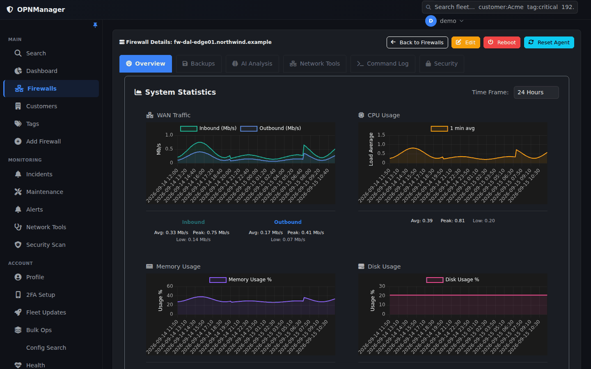](images/github/firewall-detail.png)

## Configuration

### Configuration drift

Each firewall's newest backup compared against the baseline you approved.
Serialisation noise and the fields OPNsense rewrites on every save are ignored, so an
untouched firewall does not report drift. Nothing here restores anything.

### Backup history

Per-firewall configuration backups with size, type and per-backup download, restore
and delete.

[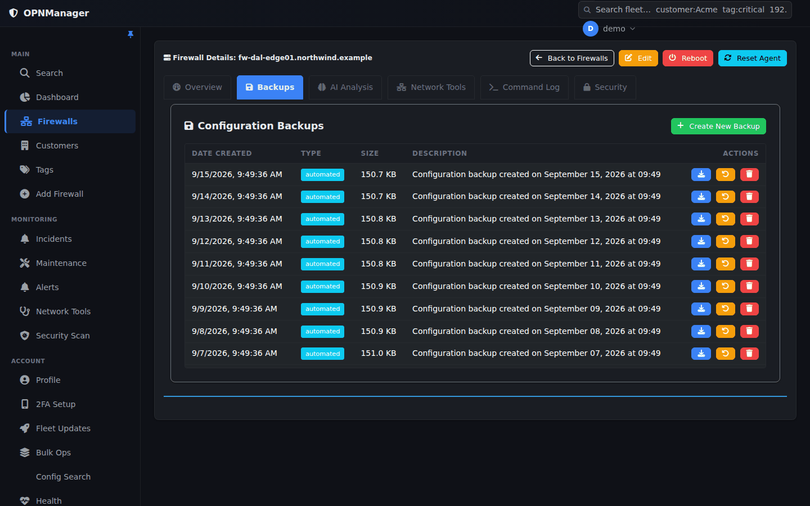](images/github/backup-history.png)

## Operations

### Fleet updates

Rollout rings — canary, then pilot, then production. Rings are a rollout mechanism,
not customer tiers. Progression is manual unless explicitly automated, and members of
a CARP pair are never updated simultaneously.

### Bulk operations

High-risk operations require typing a confirmation phrase that includes the target
count. Raw shell is deliberately not available as a bulk operation.

[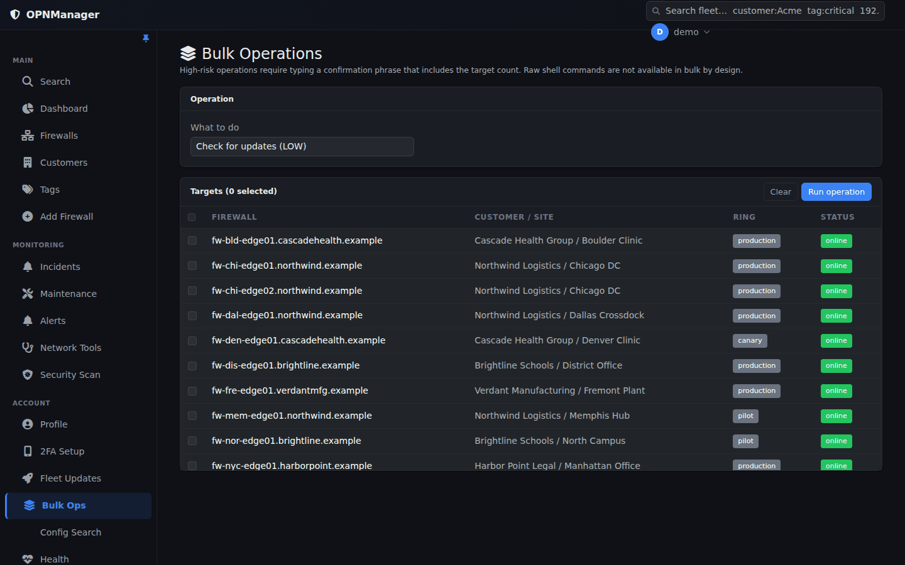](images/github/bulk-operations.png)

### Maintenance windows

Scoped to a firewall, a site or a whole customer. Monitoring, health collection and
incident recording continue during a window; only outbound notification is withheld,
and the suppression is recorded on the incident.

[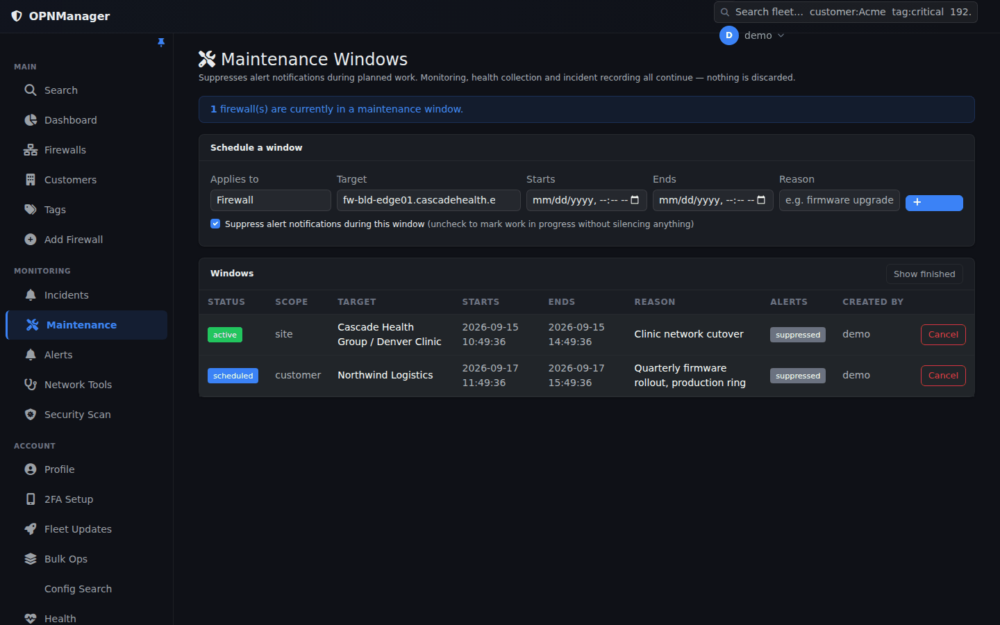](images/github/maintenance.png)

## Administration

### Staff and roles

Administrator, Technician and Read Only, defined once as a capability matrix rather
than role strings scattered through the code. Navigation and actions follow the
capability, not the role name.

[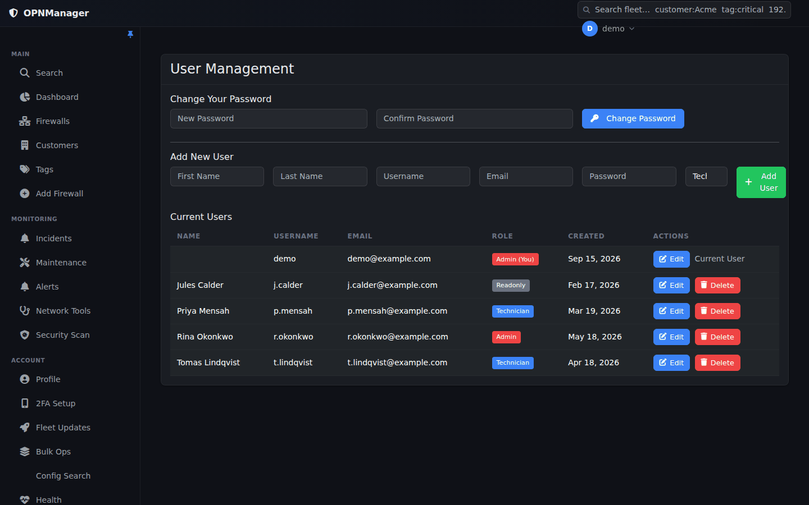](images/github/users-roles.png)

### Audit log

Who did what, to which firewall, from where — filterable by action, user, firewall,
result and date range. Credential material is never recorded.

[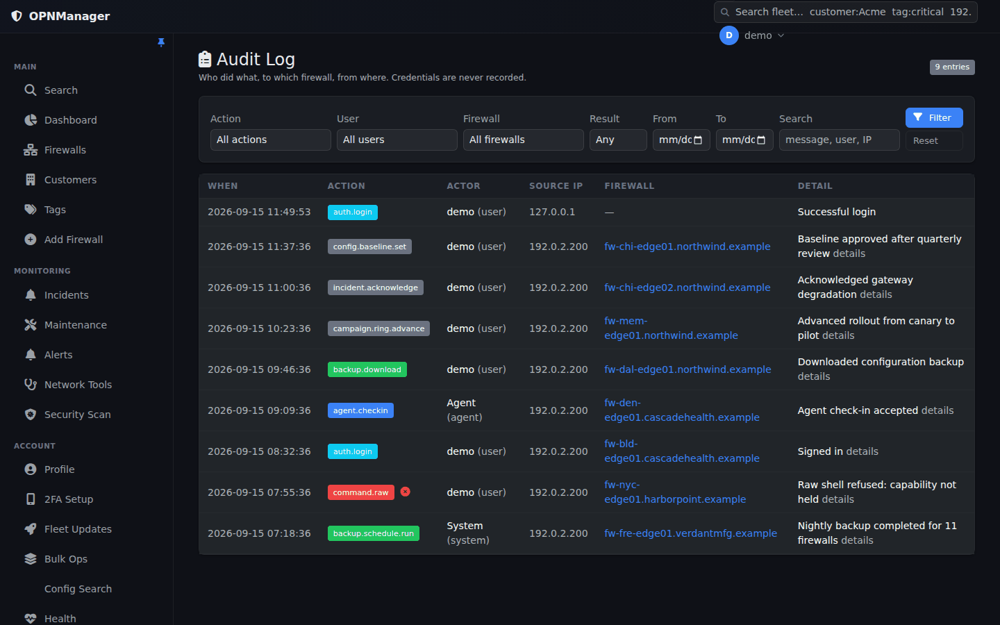](images/github/audit-log.png)

### Light theme

A full light theme with system-preference detection and a manual toggle.

[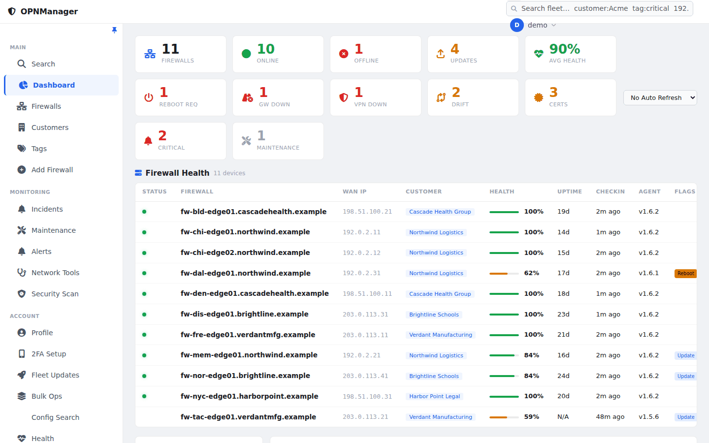](images/github/dashboard-light.png)
